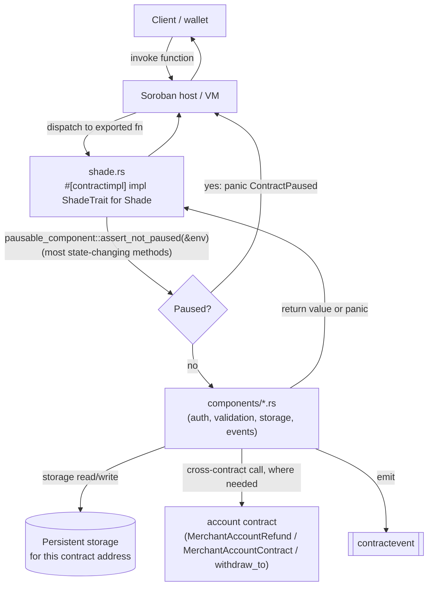

# Architecture overview

How the nine contracts in this workspace fit together, where state lives, how a request travels from the network boundary down to business logic, and why the protocol is shaped the way it is. Read this before [Workspace and Crate Layout](workspace-layout.md) or [the component pattern](component-pattern.md) if you want the "why" before the "how."

## The contracts, and how they relate

The workspace has nine deployable contract crates under `contracts/`:

| Contract | Role |
|---|---|
| **`shade`** | The primary entry point and hub. Invoices, merchants, fees, subscriptions, event ticketing, crowdfunding, escrow, NFT rewards, governance, and more all live here as components (see [the component pattern](component-pattern.md)). |
| **`account`** | Per-merchant vault contract, deployed by `shade`'s `account_factory` component. Holds merchant balances and services withdrawals/refunds that `shade` calls into. |
| **`escrow`** | Standalone two-party (buyer/seller) escrow contract. |
| **`escrow_factory`** | Deploys `escrow` instances. |
| **`ticketing`** | Standalone event-ticketing contract (organizer/event/ticket model, QR check-in). |
| **`ticketing_factory`** | Deploys `ticketing` instances. |
| **`subscription`** | Standalone recurring-billing contract (plans, subscriptions, grace periods, upgrades/downgrades). |
| **`crowdfund`** | Standalone crowdfunding contract (campaigns, pledges, stretch goals, dynamic pricing, DAO-style proposals). |
| **`crowdfund_factory`** | Deploys `crowdfund` instances. |

**`shade` is the only contract this repository's `shade` code calls into.** Searching `contracts/shade/src` for cross-contract client declarations (`#[contractclient]`) turns up exactly one external target: the `account` contract, via three narrow traits declared at their call sites —

- `invoice.rs`: `MerchantAccountRefund` (`refund`), used by `refund_invoice`, `refund_invoice_partial`, and `claim_refund`.
- `merchant.rs`: `MerchantAccountContract` (`restrict_account`), used by `restrict_merchant_account`.
- `multisig_withdrawal.rs` and `auto_withdrawal.rs`: their own `withdraw_to`-shaped client traits, used when a withdrawal proposal executes or an auto-withdrawal threshold is crossed.

`shade` also calls a `PriceOracleClient` (`invoice.rs`) for fiat-priced invoices — an external, merchant/admin-configured oracle contract, not one of the nine contracts in this workspace.

**`escrow`, `ticketing`, `subscription`, `crowdfund`, and their three factories are standalone sibling contracts, not cross-contract dependencies of `shade`.** `shade` has its own internal implementations of overlapping domains — the `escrow`, `event` (ticketing), `subscription`, and `pledge`/`campaigns` (crowdfunding) components — built directly into its own storage rather than by calling out to these sibling contracts. Nothing in `contracts/shade/src` invokes `escrow`, `ticketing`, `subscription`, `crowdfund`, or any of their factories. Whether a given integration should use `shade`'s built-in feature or deploy one of the standalone contracts is a per-deployment choice this repository does not make for you; the two are parallel implementations of related ideas, not a pipeline.

`account_factory` (a `shade` component, not a crate) is the one factory `shade` itself drives — see [Cross-Contract Calls and the Factory Pattern](cross-contract-calls.md) for the deploy/salt/initialize mechanics it shares in spirit with `escrow_factory`, `ticketing_factory`, and `crowdfund_factory`.

## Where persistent state lives

Every contract owns its own persistent storage; Soroban gives each deployed contract address its own isolated ledger-entry namespace, so there is no shared database between `shade`, `account`, and the standalone contracts. Within `shade`:

- `types.rs` defines the storage-key enums (`DataKey`, `EventKey`, `CampaignKey`, `BackerKey`, `StretchKey`, `VestingKey`, `FiatGoalKey`, `AnalyticsKey`, `NftKey`, `GovKey`, `BridgeKey`, `MultiSigKey`) — split into one enum per feature domain because Soroban caps every `#[contracttype]` enum at 50 cases. See the module-level doc comment at the top of [`contracts/shade/src/types.rs`](../../contracts/shade/src/types.rs) for the authoritative list and rationale.
- Each component reads and writes only the key variants that belong to its domain (`pausable` owns `DataKey::Paused`, `invoice` owns `DataKey::Invoice`/`DataKey::InvoiceCount`, `campaigns` owns most of `CampaignKey`, and so on). Cross-component reads go through the owning component's public getters — see [the component pattern's boundary rules](component-pattern.md#what-makes-a-good-component-boundary).
- There is currently no separate "storage model" reference page under `docs/architecture/`; storage-key partitioning and the per-domain enum list are documented in `types.rs`'s own module comment and referenced from [Upgradeability's storage compatibility rules](upgradeability.md#storage-compatibility-rules), which is the closest existing deep-dive. This overview links there rather than to a `docs/architecture/storage-model.md` that does not exist in the repository.

## How a request reaches business logic: the VM boundary to component logic

A client invokes a `shade` contract function (directly, or via a Soroban RPC `simulateTransaction`/`sendTransaction`); the Soroban host loads the contract's WASM, resolves the function against the exported `#[contractimpl]` methods, and calls into `shade.rs`. From there:

`shade_interface.rs`'s `ShadeTrait` is what makes the WASM's exported function list and the `shade.rs` implementation provably consistent — the trait is the single source of truth for the public surface, and `#[contractimpl] impl ShadeTrait for Shade` is a compile error if `shade.rs` doesn't implement every trait method with a matching signature.

## Request lifecycle: `pay_invoice`

Tracing an actual state-changing call end to end, verified against [`contracts/shade/src/shade.rs`](../../contracts/shade/src/shade.rs) and [`contracts/shade/src/components/invoice.rs`](../../contracts/shade/src/components/invoice.rs) — this is the exact guard and step order, not an assumed one:

1. Client calls `pay_invoice(payer, invoice_id)`.
2. `shade.rs::pay_invoice` calls `pausable_component::assert_not_paused(&env)` — panics with `ContractPaused` (error 9) if the contract is paused. This is the *only* guard `shade.rs` applies itself before delegating.
3. `shade.rs::pay_invoice` delegates to `invoice_component::pay_invoice(&env, &payer, invoice_id)`.
4. `invoice::pay_invoice` calls `payer.require_auth()` — the payer must have authorized this specific invocation.
5. `invoice::pay_invoice` calls `pay_invoice_inner`, which loads the invoice, checks its status is `Pending` or `PartiallyPaid` (else panics `InvalidInvoiceStatus`), computes the remaining amount via `resolve_invoice_amount` (which, for a fiat-priced invoice, re-queries the oracle), and calls `pay_invoice_partial_inner` with that remaining amount.
6. `pay_invoice_partial_inner` re-validates: amount positive, invoice not expired, status still payable, amount does not exceed the invoice total, token still globally accepted. It re-resolves the fiat quote (`refresh_fiat_invoice_quote`) if applicable.
7. It resolves the merchant's address and merchant-account address, then calls `platform_fee::route_from_payer`, which computes the merchant/platform split (`compute_split`) and **executes the token transfers** — this is where funds actually move, via the SEP-41 token contract's `transfer`.
8. It updates the `Invoice` record (`amount_paid`, `status`, `payer`, `date_paid` if now fully paid) and writes it back to storage.
9. It emits `InvoicePaidEvent`, then `PaymentSplitRoutedEvent` (via `finalize_route` inside `route_from_payer`, which itself emits `PlatformFeeRoutedEvent` before returning — so a single `pay_invoice` call can emit `PlatformFeeRoutedEvent`, then `InvoicePaidEvent`, then `PaymentSplitRoutedEvent`, in that order).
10. It calls `history::record_transaction`, appending a `Transaction` to the payer's log (no event).
11. It calls `auto_withdrawal::check_and_trigger_auto_withdrawal`, which may itself move funds again and emit `AutoWithdrawalTriggeredEvent` if the merchant's configured threshold was just crossed.

**Guard order for `pay_invoice` specifically: pause check (step 2) → `require_auth` (step 4) → status/amount/expiry/token validation (steps 5–6) → fee computation and token transfer (step 7) → storage write (step 8) → events (step 9) → history (step 10) → auto-withdrawal sweep (step 11).** `pay_invoice` does not call the reentrancy guard (`reentrancy::enter`/`exit`) — that guard is used selectively by a different set of functions (see [the component pattern's guard discussion](component-pattern.md#how-authorization-guards-storage-and-events-interact-with-the-boundary)); do not assume it wraps every fund-moving path.

## Layering responsibilities, for reviewing a PR

| Layer | Owns | A PR touching it should... |
|---|---|---|
| `shade_interface.rs` | The complete public function signature list (`ShadeTrait`) | Add exactly one line per new public function; never contain logic. |
| `shade.rs` | Wiring: the pause guard (where applicable) plus delegation to one component call | Stay at "guard, then delegate" — if a method body does anything else, that logic belongs in a component. |
| `components/` | All actual logic: auth, validation, storage access, cross-contract calls, event emission | Own only its domain's storage keys; reach other domains through the owning component's public functions, never raw storage access. |
| `types.rs` | Every `#[contracttype]` record and storage-key enum | New persisted fields/variants only ever added, never renamed/retyped/moved — see [Upgradeability's storage compatibility rules](upgradeability.md#storage-compatibility-rules). |
| `events.rs` | Every `#[contractevent]` struct and its `publish_*` helper | New events added here, never constructed ad hoc inside a component. |
| `errors.rs` | Every `#[contracterror]` enum, partitioned into non-overlapping numeric ranges per domain | New error variants appended within the domain's assigned range; never renumber an existing one. |

## Architectural rationale

**One hub contract with components, rather than many small contracts, for the core payment domain.** Invoices, merchants, fees, subscriptions, ticketing, and crowdfunding all need to agree on shared concepts — a merchant's ID and active/verified state, the accepted-token whitelist, the platform fee split — cheaply and atomically. Keeping them in one contract with one storage namespace means `pay_invoice` can read the merchant's account address, compute the fee, transfer tokens, and record the payment in a single atomic call with no cross-contract round trip for the shared state. The component pattern (see [component-pattern.md](component-pattern.md)) buys the maintainability of separate modules without paying the deployment, cross-contract-call, and atomicity cost of separate contracts for logic that is this interdependent.

**Factories for per-entity contracts, where isolation matters more than shared state.** A merchant's `account` contract genuinely benefits from being its own deployed instance: it isolates one merchant's held balance from every other merchant's, under its own address, so a bug or restriction on one account contract instance cannot touch another's funds. `account_factory` (in `shade`) and the three standalone factories (`escrow_factory`, `ticketing_factory`, `crowdfund_factory`) exist for exactly this shape of problem — deploy one instance per entity, deterministically, from a registered WASM hash. See [Cross-Contract Calls and the Factory Pattern](cross-contract-calls.md) for the mechanics.

**Events as the off-chain integration surface.** Nothing in this contract exposes a webhook or push mechanism; every state transition that matters to an integrator is instead published as a `#[contractevent]` (see [Events reference](../reference/events.md)). An indexer or backend is expected to watch the event stream rather than polling every query function, which is both cheaper for the integrator and keeps the contract itself free of any notion of "who is listening."

## Related pages

- [The component pattern](component-pattern.md) — the module-level structure inside `shade`, with a full inventory of all 34 components.
- [Workspace and Crate Layout](workspace-layout.md) — the Cargo workspace, directory tree, and per-crate file conventions.
- [Cross-Contract Calls and the Factory Pattern](cross-contract-calls.md) — factory deployment mechanics, SEP-41 token interactions, and authorization propagation across contract boundaries.
- [Upgradeability, WASM hash management, and versioning](upgradeability.md) — how the hub's code (and, separately, factory-deployed WASM) can change after deployment, and the storage-compatibility rules that govern it.
- [`ShadeTrait` function reference](../reference/shade-interface.md)
- [Events reference](../reference/events.md)

← [Back to Architecture](README.md)
