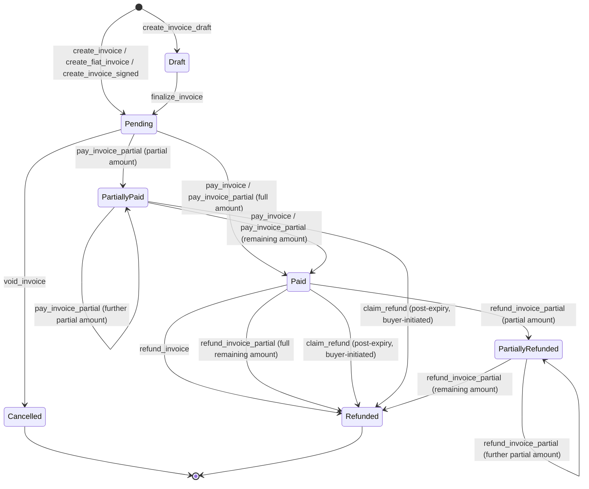

# Invoice lifecycle and statuses

Shade [invoices](../glossary.md#invoice) are payable requests created by a [merchant](../glossary.md#merchant), tracked through the `InvoiceStatus` enum as they move from creation through payment, refund, cancellation, or expiry. This page is the canonical guide to that lifecycle: every creation path, every status, every transition, and how expiry and filtering work.

For the full `Invoice` struct field list and every function signature verbatim, see the [data types reference](../reference/data-types.md) and the [`ShadeTrait` function reference](../reference/shade-interface.md) — this page focuses on the lifecycle narrative and does not duplicate those tables.

## The `Invoice` struct

Defined at [`contracts/shade/src/types.rs`](../../contracts/shade/src/types.rs) (`struct Invoice`):

| Field | Type | Meaning | Set by | Mutable? |
|---|---|---|---|---|
| `id` | `u64` | Monotonically increasing invoice ID, assigned from `DataKey::InvoiceCount`. | Contract, at creation | No |
| `description` | `String` | Free-text description, capped at 100 characters. | Merchant, at creation | Yes, via `amend_invoice` (Pending only) |
| `amount` | `i128` | Invoice amount in the token's base units. For fiat-priced invoices this is the last-resolved crypto amount, not the fiat face value. | Merchant (crypto) or oracle-resolved (fiat), at creation | Yes — updated by `amend_invoice` and by fiat re-quoting on first payment |
| `token` | `Address` | Settlement token contract address. Must be accepted globally and by the merchant. | Merchant, at creation | No |
| `status` | `InvoiceStatus` | Current lifecycle state. See [Statuses](#statuses) below. | Contract | Yes — this is the state machine |
| `merchant_id` | `u64` | Numeric ID of the issuing merchant. | Contract, resolved from the merchant address | No |
| `payer` | `Option<Address>` | Address that made the first payment. `None` until a payment lands; locked to that address thereafter. | Contract, on first payment | Set once, then immutable |
| `date_created` | `u64` | Ledger timestamp at creation. | Contract | No |
| `date_paid` | `Option<u64>` | Ledger timestamp when the invoice reached `Paid`. Drives the refund window. | Contract, on full payment | Set once |
| `amount_paid` | `i128` | Cumulative amount paid so far (supports partial payment). | Contract | Yes, increases with each payment |
| `amount_refunded` | `i128` | Cumulative amount refunded so far. | Contract | Yes, increases with each refund |
| `expires_at` | `Option<u64>` | Business-level expiry timestamp (ledger seconds). `None` means the invoice never expires. See [Expiry](#expiry). | Merchant, at creation (optional) | No |
| `pricing_mode` | `InvoicePricingMode` | `FixedCrypto` or `FixedFiat` — see [Pricing modes](#pricing-modes). | Contract, based on creation path | No |
| `fiat_pricing` | `FiatPricingData` | `None` or `Some(FiatPricing)` — the fiat currency/amount/decimals backing a fiat-priced invoice. | Contract, based on creation path | No |

## Pricing modes

`InvoicePricingMode` (`contracts/shade/src/types.rs`) has two variants:

| Variant | Meaning |
|---|---|
| `FixedCrypto` | `amount` is a fixed quantity of `token`'s base units, set at creation and never re-derived. |
| `FixedFiat` | `amount` is derived from a fiat face value via an oracle. Re-resolved on read and on first payment (see below). |

`FiatPricingData` (`contracts/shade/src/types.rs`) wraps an optional `FiatPricing`:

```rust
pub enum FiatPricingData {
    None,
    Some(FiatPricing),
}

pub struct FiatPricing {
    pub currency: String,
    pub amount: i128,
    pub decimals: u32,
}
```

`FiatPricingData` exists because Soroban's `#[contracttype]` machinery does not support `Option<FiatPricing>` directly inside another `#[contracttype]` struct, so the crate uses an explicit two-variant enum as a workaround (see the comment above the type in `types.rs`).

### Fiat amount resolution

`resolve_fiat_invoice_amount` (`contracts/shade/src/components/invoice.rs`) converts a fiat face value to token base units:

```
numerator   = fiat_pricing.amount * 10^token_decimals * 10^price_decimals
denominator = oracle_price * 10^fiat_pricing.decimals
resolved_amount = numerator / denominator
```

`oracle_price` comes from the token's registered `OracleConfig` (see [Oracle Config](../glossary.md#oracle-config)) via `PriceOracleClient::get_price`. If the price is `<= 0` or the resolved amount is `<= 0`, the call panics with `OraclePriceUnavailable` (35).

For a `FixedFiat` invoice, the quote is refreshed (`refresh_fiat_invoice_quote`) every time a payment is attempted (`pay_invoice_partial_inner`), but **only while `amount_paid == 0`** — once any payment has landed, `amount` is frozen at its last-resolved value so a partially paid invoice cannot have its remaining balance re-priced mid-payment. Each refresh publishes a `FiatInvoicePricedEvent`.

## Creation paths

All four creation paths write a new `Invoice` with a fresh ID from `DataKey::InvoiceCount` and validate through the shared `validate_invoice_creation` helper (amount > 0, description ≤ 100 chars, merchant registered and active, token accepted globally and by the merchant, `expires_at` not already in the past, amount greater than the computed platform fee).

### `create_invoice`

```rust
fn create_invoice(env: Env, merchant: Address, description: String, amount: i128, token: Address, expires_at: Option<u64>) -> u64;
```

- **Auth:** `merchant.require_auth()`.
- **Initial status:** `Pending`.
- **Pricing mode:** `FixedCrypto`, `fiat_pricing: FiatPricingData::None`.
- **Emits:** `InvoiceCreatedEvent`.
- Standard crypto-denominated invoice. `amount` is the exact token amount to be paid.

### `create_fiat_invoice`

```rust
fn create_fiat_invoice(env: Env, merchant: Address, description: String, fiat_amount: i128, fiat_currency: String, fiat_decimals: u32, token: Address, expires_at: Option<u64>) -> u64;
```

- **Auth:** `merchant.require_auth()`.
- **Initial status:** `Pending`.
- **Pricing mode:** `FixedFiat`, `fiat_pricing: FiatPricingData::Some(FiatPricing { currency, amount: fiat_amount, decimals: fiat_decimals })`.
- The crypto `amount` is resolved via the oracle immediately at creation (before the standard validation runs, so the validated amount is already the crypto-equivalent), then re-validated through `validate_invoice_creation`.
- **Emits:** `InvoiceCreatedEvent` and `FiatInvoicePricedEvent` (the initial quote).

### `create_invoice_draft` + `finalize_invoice`

```rust
fn create_invoice_draft(env: Env, merchant: Address, description: String, amount: i128, token: Address, expires_at: Option<u64>) -> u64;
fn finalize_invoice(env: Env, merchant: Address, invoice_id: u64);
```

- **`create_invoice_draft`:** same validation and fields as `create_invoice`, but **initial status is `Draft`**, and `InvoiceCreatedEvent` is deliberately **not** emitted (the source has an explicit comment: "we intentionally don't emit InvoiceCreatedEvent here since it's a draft"). Pricing mode is always `FixedCrypto` for drafts — there is no fiat draft path.
- **Intermediate behavior:** a `Draft` invoice exists in storage and can be read via `get_invoice`, but `pay_invoice`/`pay_invoice_partial` reject it (status must be `Pending` or `PartiallyPaid`), so it is not payable.
- **`finalize_invoice`:** requires `merchant.require_auth()` and that the caller is the invoice's own merchant. Requires the invoice to currently be `Draft` (`InvalidInvoiceStatus` otherwise). Transitions `Draft → Pending` and **at this point** emits `InvoiceCreatedEvent` — the event that downstream indexers key off of is emitted at finalization, not at draft creation.
- `finalize_invoice` does not accept amount/description changes; use `amend_invoice` first if the draft's terms need to change while still in `Draft` — `amend_invoice` requires status `Pending`, so in practice drafts must be amended (if needed) through direct invoice mutation only via the paths that check `Draft`, i.e. no amendment path currently targets `Draft` invoices; a draft's amount/description are fixed once created and only change via `finalize_invoice` (status only) or full recreation.

### `create_invoice_signed`

```rust
fn create_invoice_signed(env: Env, caller: Address, merchant: Address, description: String, amount: i128, token: Address, nonce: BytesN<32>, signature: BytesN<64>) -> u64;
```

- **Auth:** the **caller** (not the merchant) must authorize (`caller.require_auth()`), and the caller must hold the `Manager` role or be the contract `Admin` — `access_control::has_role` treats the admin address as implicitly holding every role. A `Guest` or `Operator`-only caller is rejected with `NotAuthorized` (1). This lets a relayer (the manager/admin) submit the transaction on the merchant's behalf.
- **Signature verification:** the merchant must have previously registered an Ed25519 public key via `set_merchant_key`. `signature_util::verify_invoice_signature` looks up that key by the `merchant` address (not the caller), builds a message from `[contract_address, merchant_address, nonce, amount (big-endian bytes), token_address, description]` (XDR-encoded via `to_xdr`, pipe-delimited), and calls `env.crypto().ed25519_verify(&key, &message, &signature)`. The signature is over the *merchant's* intent, verified independently of who submits the transaction.
- **Nonce:** `invalidate_nonce` checks `DataKey::UsedNonce(merchant, nonce)` has not been set, panics with `NonceAlreadyUsed` if it has, then marks it used and emits `NonceInvalidatedEvent`. The nonce is scoped per-merchant, not global, and is single-use.
- **Initial status:** `Pending`. **Pricing mode:** always `FixedCrypto` — there is no signed-fiat path. `expires_at` is always `None` for this path (the function does not accept an `expires_at` parameter).
- **Emits:** `InvoiceCreatedEvent`.

### How the paths differ

| Path | Auth | Initial status | Pricing mode | Expiry supported | Event on creation |
|---|---|---|---|---|---|
| `create_invoice` | Merchant | `Pending` | `FixedCrypto` | Yes | `InvoiceCreatedEvent` |
| `create_fiat_invoice` | Merchant | `Pending` | `FixedFiat` | Yes | `InvoiceCreatedEvent` + `FiatInvoicePricedEvent` |
| `create_invoice_draft` | Merchant | `Draft` | `FixedCrypto` | Yes | None (deferred to `finalize_invoice`) |
| `create_invoice_signed` | Manager/Admin (on merchant's behalf, ed25519-verified) | `Pending` | `FixedCrypto` | No (`expires_at` always `None`) | `InvoiceCreatedEvent` |

## Statuses

`InvoiceStatus` (`contracts/shade/src/types.rs`) has seven variants:

| Variant | Value | Meaning |
|---|---|---|
| `Pending` | 0 | Created and payable; no payment has fully settled it yet. |
| `Paid` | 1 | Fully paid (`amount_paid == amount`). |
| `Cancelled` | 2 | Voided by the merchant before any payment. |
| `Refunded` | 3 | Fully refunded — either the entire paid amount was refunded in one call, or partial refunds accumulated to the full amount. |
| `PartiallyRefunded` | 4 | Some but not all of the paid amount has been refunded. |
| `PartiallyPaid` | 5 | Some but not all of the invoice amount has been paid. |
| `Draft` | 6 | Created via `create_invoice_draft`, not yet finalized, not payable. |

## State diagram

Every transition below is implemented in [`contracts/shade/src/components/invoice.rs`](../../contracts/shade/src/components/invoice.rs). No transition is included unless it corresponds to an actual function call in that file.



`amend_invoice` is not a status transition — it mutates `amount`/`description` while the invoice remains `Pending` (see [Amendment](#amendment) below), so it is omitted from the diagram.

### Transition reference

| Transition | Function | Caller / auth | Preconditions | Funds movement | Resulting status | Event |
|---|---|---|---|---|---|---|
| Create (draft) | `create_invoice_draft` | Merchant | Passes `validate_invoice_creation` | None | `Draft` | None |
| Create (payable) | `create_invoice`, `create_fiat_invoice`, `create_invoice_signed` | Merchant, or Manager/Admin (signed) | Passes `validate_invoice_creation` | None | `Pending` | `InvoiceCreatedEvent` (+ `FiatInvoicePricedEvent` for fiat) |
| Finalize | `finalize_invoice` | Merchant (must own the invoice) | Status is `Draft` | None | `Pending` | `InvoiceCreatedEvent` |
| Void | `void_invoice` | Merchant (must own the invoice) | Status is `Pending` | None | `Cancelled` | `InvoiceCancelledEvent` |
| Pay (partial) | `pay_invoice_partial` (also reachable via `pay_invoice` computing the remaining balance, and via `pay_invoices_batch`) | Payer | Status `Pending` or `PartiallyPaid`; not expired; `amount_paid + amount <= amount`; token accepted; if a payer is already recorded, the new payer must match it | Payer → merchant (net of platform fee) via `platform_fee::route_from_payer`; fee → platform account | `PartiallyPaid` if balance remains, else `Paid` | `InvoicePaidEvent`, `PaymentSplitRoutedEvent` |
| Full refund | `refund_invoice` | Merchant (must own the invoice) | Status `Paid`; payer recorded; within 7-day refund window from `date_paid`; remaining refundable amount > 0 | Merchant account → payer, full `amount - amount_refunded` | `Refunded` | `InvoiceRefundedEvent` |
| Partial refund | `refund_invoice_partial` | Merchant (must own the invoice) | Status `Paid` or `PartiallyRefunded`; within 7-day window; `amount > 0`; cumulative refund ≤ `amount` | Merchant account → payer, `amount` given | `Refunded` if cumulative refund reaches `amount`, else `PartiallyRefunded` | `InvoiceRefundedEvent` (if it reaches full) or `InvoicePartiallyRefundedEvent` |
| Expiry refund | `claim_refund` | Buyer (the recorded `payer`) | `expires_at` is set and has passed; status `Paid` or `PartiallyPaid`; caller is the recorded payer; unrefunded amount > 0 | Merchant account → buyer, `amount_paid - amount_refunded` | `Refunded` | `EscrowExpiredRefundEvent` |

### Amendment

```rust
fn amend_invoice(env: Env, merchant: Address, invoice_id: u64, new_amount: Option<i128>, new_description: Option<String>);
```

`amend_invoice` requires `merchant.require_auth()`, that the caller owns the invoice, and that the invoice is currently `Pending` (any other status panics with `InvalidInvoiceStatus`). It does not change `status`. Either or both of `new_amount`/`new_description` may be supplied; supplying neither is a no-op that still emits `InvoiceAmendedEvent` with `old_amount == new_amount`. `new_amount`, if given, must be `> 0`. Emits `InvoiceAmendedEvent(invoice_id, merchant, old_amount, new_amount, timestamp)`.

Amendment is **only available on `Pending` invoices** — a `Draft`, `Paid`, `PartiallyPaid`, `Cancelled`, `Refunded`, or `PartiallyRefunded` invoice cannot be amended.

## Expiry

Expiry is entirely opt-in and stored as a plain business field, not a Soroban storage TTL:

- **Timestamp creation:** `expires_at: Option<u64>` is supplied by the caller at creation (`create_invoice`, `create_fiat_invoice`, `create_invoice_draft`). `create_invoice_signed` never sets one (always `None`).
- **Units:** raw Soroban ledger seconds, the same unit as `env.ledger().timestamp()` — not a duration, an absolute timestamp.
- **Creation-time validation:** `validate_invoice_creation` panics with `InvoiceExpired` (27) if `expires_at` is already `< env.ledger().timestamp()` at creation time.
- **Payment-time enforcement:** `pay_invoice_partial_inner` checks `env.ledger().timestamp() >= expires_at` and panics with `InvoiceExpired` if the invoice has expired — the check uses `>=`, so an invoice expires exactly at its `expires_at` timestamp, not strictly after it. An invoice with `expires_at: None` never fails this check regardless of ledger time.
- **Lazy, not proactive:** there is no separate `Expired` status and no background process that flips a status when time passes. Expiry is detected lazily, purely by comparing `env.ledger().timestamp()` against `expires_at` at the moment `pay_invoice`/`pay_invoice_partial` or `claim_refund` is called. `get_invoice` and `get_invoices` return the invoice's literal stored `status` and do not synthesize an "expired" state.
- **What remains available after expiry:** `get_invoice`/`get_invoices` still return the invoice. If it was never paid, it stays `Pending` forever (no automatic cancellation) but can no longer be paid. `void_invoice` still works on an expired-but-unpaid `Pending` invoice (voiding does not check `expires_at`). `amend_invoice` similarly is not blocked by expiry as long as the invoice is `Pending` — expiry only blocks the *payment* path.
- **Post-expiry refund (`claim_refund`):** if an invoice **was already paid or partially paid** before expiring, the buyer (recorded `payer`) can call `claim_refund` once `env.ledger().timestamp() >= expires_at`, moving the unrefunded balance back from the merchant account to the buyer and setting status to `Refunded`. This reuses the `EscrowError` error variants (`EscrowNotExpired`, `EscrowAlreadyRefunded`) and publishes an `EscrowExpiredRefundEvent` despite being invoice logic — this is a naming artifact in the source, not a call into the standalone `escrow`/`escrow_factory` crates (which are unrelated contracts; see the [escrow contract reference](../contracts/escrow.md)). `claim_refund` is unrelated to and does not go through `refund_invoice`'s 7-day merchant-initiated refund window.

> **Note:** business expiry (`Invoice::expires_at`) and Soroban storage TTL/rent (see [TTL / Rent](../glossary.md#ttl--rent)) are two separate mechanisms. `invoice.rs` writes invoices with `env.storage().persistent()` and does not call any TTL-extension host function in the reviewed creation, payment, or refund paths — storage lifetime is governed by the platform's persistent-storage rent rules, not by anything the invoice component does. `expires_at` never affects whether the ledger entry itself is archived.

## Reads and filtering

### `get_invoice`

```rust
fn get_invoice(env: Env, invoice_id: u64) -> Invoice;
```

Looks up `DataKey::Invoice(invoice_id)`. Panics with `InvoiceNotFound` (8) if the ID does not exist. No filtering, no fiat re-resolution — returns the invoice exactly as stored.

### `resolve_invoice_amount`

```rust
fn resolve_invoice_amount(env: Env, invoice_id: u64) -> i128;
```

Returns `invoice.amount` for `FixedCrypto` invoices. For a `FixedFiat` invoice that has not yet received any payment (`amount_paid == 0`), it re-resolves the current fiat quote via the oracle **without persisting it** (unlike the payment path, this is a read-only re-quote). Once `amount_paid > 0`, it returns the frozen `invoice.amount` like any other invoice — the fiat quote is locked in at first payment.

### `get_invoices` and `InvoiceFilter`

```rust
fn get_invoices(env: Env, filter: InvoiceFilter) -> Vec<Invoice>;
```

`InvoiceFilter` (`contracts/shade/src/types.rs`):

| Field | Type | Semantics |
|---|---|---|
| `status` | `Option<u32>` | Exact match against `invoice.status as u32` (i.e. against the numeric `InvoiceStatus` value in the [Statuses](#statuses) table). |
| `merchant` | `Option<Address>` | Resolved to a merchant ID via `DataKey::MerchantId`; invoices are matched by `merchant_id`. If the address has no registered merchant ID, every invoice is excluded (not an error — the filter simply matches nothing). |
| `min_amount` | `Option<u128>` | `invoice.amount >= min_amount` (cast to `i128` for comparison). |
| `max_amount` | `Option<u128>` | `invoice.amount <= max_amount`. |
| `start_date` | `Option<u64>` | `invoice.date_created >= start_date`. |
| `end_date` | `Option<u64>` | `invoice.date_created <= end_date`. |

Implementation notes, verified directly from `get_invoices` in `invoice.rs`:

- The function iterates **every invoice ID from 1 to the current `InvoiceCount`** and applies all supplied filters as an AND — there is no index by status, merchant, or date range.
- **No pagination and no ordering guarantee are implemented.** The function returns a plain `Vec<Invoice>` built by iterating IDs in ascending order (so results happen to come back in ID/creation order), but there is no page size, cursor, or `limit`/`offset` parameter in the signature — do not document or rely on pagination that isn't there.
- All filter fields are optional; omitting a field (leaving it `None`) means "no constraint on this field," not "match only invoices where this field is unset."
- Date-range filtering (`start_date`/`end_date`) filters on `date_created`, not `date_paid` or any other timestamp — there is no way to filter by payment date or refund date through this function.
- **Missing invoice behavior:** IDs are 1-indexed and contiguous by construction (every creation path increments `InvoiceCount` and writes that ID), so under normal operation there are no "holes." The loop uses `get::<_, Invoice>(...)` with `if let Some(...)`, so if an ID were ever missing from storage it would simply be skipped rather than causing an error.

## Events

Every lifecycle transition emits an event defined in [`contracts/shade/src/events.rs`](../../contracts/shade/src/events.rs). There is currently no standalone central events reference page in this repository (`docs/reference/README.md` lists one as *planned*), so the payload shape is given here in full for the invoice-specific events; do not assume any other page's version of these payloads takes precedence.

| Event | Emitted by | Payload |
|---|---|---|
| `InvoiceCreatedEvent` | `create_invoice`, `create_fiat_invoice`, `create_invoice_signed`, `finalize_invoice` | `invoice_id: u64`, `merchant: Address`, `amount: i128`, `token: Address` |
| `FiatInvoicePricedEvent` | `create_fiat_invoice` (initial quote), `pay_invoice_partial_inner` via `refresh_fiat_invoice_quote` (re-quote before first payment) | `invoice_id: u64`, `token: Address`, `resolved_amount: i128`, `timestamp: u64` |
| `InvoicePaidEvent` | `pay_invoice`, `pay_invoice_partial`, `pay_invoices_batch` (each settled invoice) | `invoice_id: u64`, `merchant_id: u64`, `merchant_account: Address`, `payer: Address`, `amount: i128`, `fee: i128`, `merchant_amount: i128`, `token: Address`, `timestamp: u64` |
| `PaymentSplitRoutedEvent` | Same payment functions, alongside `InvoicePaidEvent` | `invoice_id: u64`, `merchant_account: Address`, `platform_account: Address`, `merchant_amount: i128`, `platform_amount: i128`, `token: Address`, `timestamp: u64` |
| `InvoiceCancelledEvent` | `void_invoice` | `invoice_id: u64`, `merchant: Address`, `timestamp: u64` |
| `InvoiceRefundedEvent` | `refund_invoice`; `refund_invoice_partial` when the cumulative refund reaches the full amount | `invoice_id: u64`, `merchant: Address`, `amount: i128` (full refunded amount) |
| `InvoicePartiallyRefundedEvent` | `refund_invoice_partial` when the cumulative refund is still less than the full amount | `invoice_id: u64`, `merchant: Address`, `amount: i128` (this refund's amount), `total_amount_refunded: i128` |
| `InvoiceAmendedEvent` | `amend_invoice` | `invoice_id: u64`, `merchant: Address`, `old_amount: i128`, `new_amount: i128`, `timestamp: u64` |
| `EscrowExpiredRefundEvent` | `claim_refund` | `invoice_id: u64`, `buyer: Address`, `amount: i128`, `token: Address`, `timestamp: u64` |
| `NonceInvalidatedEvent` | `create_invoice_signed`, via `signature_util::invalidate_nonce` | `merchant: Address`, `nonce: BytesN<32>`, `timestamp: u64` |

## Related pages

- [Data types reference](../reference/data-types.md) — full `Invoice`/`InvoiceFilter` field tables.
- [`ShadeTrait` function reference](../reference/shade-interface.md) — complete invoice function signatures and error codes.
- [Escrow contract reference](../contracts/escrow.md) — unrelated to `claim_refund`'s `Escrow*`-named errors/events; covers the separate standalone `escrow`/`escrow_factory` crates and the hub's own independent escrow feature.
- [Fiat pricing and oracles](./fiat-pricing-and-oracles.md) — background on `OracleConfig` and fiat-to-crypto conversion.
- [Protocol Glossary](../glossary.md) — `invoice`, `merchant`, `payer`, `fiat pricing`, `signed invoice`, `draft invoice` terms.
