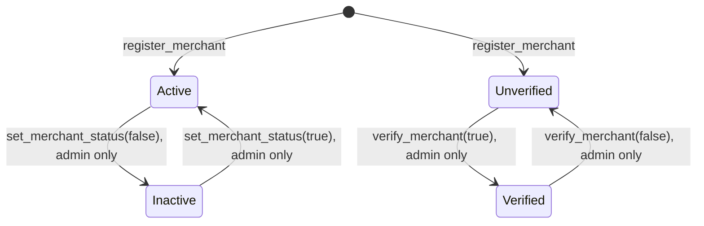

# Merchants

A [merchant](../glossary.md#merchant) is the party that registers with Shade to create invoices, subscription plans, events, and campaigns, and receive payments. This page traces registration, activation, verification, configuration, and querying entirely from [`contracts/shade/src/components/merchant.rs`](../../contracts/shade/src/components/merchant.rs), the `Merchant`/`MerchantFilter` types in [`contracts/shade/src/types.rs`](../../contracts/shade/src/types.rs), and every call site across `contracts/shade/src/components/` that reads a merchant's active/verified state.

## Registration — `register_merchant`

Verified at [`merchant.rs:14-61`](../../contracts/shade/src/components/merchant.rs#L14-L61).

- **Caller:** the address becoming the merchant (`merchant.require_auth()`); there is no admin gate — anyone can self-register.
- **Idempotency:** panics `MerchantAlreadyRegistered` if `DataKey::MerchantId(merchant)` already exists — one address can register at most once.
- **ID assignment:** follows the standard [ID-counter pattern](../architecture/storage-model.md#id-counter-pattern) — reads `DataKey::MerchantCount` (defaulting to `0`), assigns `new_id = merchant_count + 1`, writes the new `Merchant` record under `DataKey::Merchant(new_id)`, an address→ID reverse index under `DataKey::MerchantId(merchant)`, and the incremented counter back to `DataKey::MerchantCount`.
- **`Merchant` record fields and their defaults at registration:**

| Field | Value at registration |
|---|---|
| `id` | The newly assigned ID. |
| `address` | The registering address. |
| `active` | `true` — a merchant is active immediately on registration; there is no separate approval step. |
| `verified` | `false` — verification is never granted at registration; see [Verification](#verification). |
| `date_registered` | `env.ledger().timestamp()` at registration time. |
| `account` | Set to the merchant's own address, **not** a separately deployed `account` contract instance. Configuring a dedicated `account` contract requires a later `set_merchant_account` call (or, per [`docs/contracts/shade.md`](../contracts/shade.md#post-deploy-configuration-checklist), a deployment flow that calls `account_factory::deploy_account` and then `set_merchant_account`). |
| `webhook` | Empty string. |
| `auto_withdrawal_recipient` | `None`. |
| `auto_withdrawal_thresholds` | Empty vector. |

- **Initial config:** no accepted-token list, fee override, or key is set at registration — `MerchantTokens`, `MerchantPlatformFee`, and `MerchantKey` are all absent until configured separately.
- **Event:** `MerchantRegisteredEvent { merchant, merchant_id, timestamp }`.

## Activation

**Activation and verification are independent fields on the `Merchant` record** (`active: bool` and `verified: bool`), each with its own setter, getter, and — critically — its own, different set of enforcement points across the codebase. They are not two facets of one status enum.

- **Setter:** `set_merchant_status(admin, merchant_id, status)` — verified at [`merchant.rs:114-149`](../../contracts/shade/src/components/merchant.rs#L114-L149). Caller must be `admin` (`core_component::assert_admin`); there is no merchant-self-service path to deactivate or reactivate. Panics `MerchantNotFound` for ID `0` or an ID beyond the current `MerchantCount`. Sets `merchant.active = status` and re-stores the record. Emits `MerchantStatusChangedEvent { merchant_id, active: status, timestamp }`.
- **Getter:** `is_merchant_active(merchant_id)` — verified at [`merchant.rs:151-173`](../../contracts/shade/src/components/merchant.rs#L151-L173). Same `merchant_id == 0` / out-of-range panics as the setter; reads and returns `merchant.active`.
- **What requires an active merchant — every enforcement site found across `contracts/shade/src/components/`:**

| Component | Function (as declared) | Effect of `active == false` |
|---|---|---|
| `invoice.rs` | `validate_invoice_creation` (used by `create_invoice`, `create_fiat_invoice`, `create_invoice_draft`, `create_invoice_signed`) | Panics `MerchantNotActive` — an inactive merchant cannot create any new invoice. |
| `merchant.rs` | `set_merchant_accepted_tokens` | Panics `MerchantNotActive`. |
| `merchant.rs` | `remove_merchant_accepted_token` | Panics `MerchantNotActive`. |
| `auto_withdrawal.rs` | Two call sites (not independently traced into this component for this page) | Panics `MerchantNotActive`. |
| `backer_rewards.rs` | One call site (not independently traced for this page) | Panics `MerchantNotActive`. |
| `campaigns.rs` | One call site (not independently traced for this page) | Panics `MerchantNotActive`. |
| `event.rs` | One call site (not independently traced for this page) | Panics `MerchantNotActive`. |
| `multisig_withdrawal.rs` | One call site (not independently traced for this page) | Panics `MerchantNotActive`. |
| `nft.rs` | One call site (not independently traced for this page) | Panics `MerchantNotActive`. |
| `pledge.rs` | One call site (not independently traced for this page) | Panics `MerchantNotActive`. |

- **Effect on existing invoices/payments/subscriptions:** deactivating a merchant does not touch any existing `Invoice`, `Subscription`, or `Escrow` record — verified absent from `set_merchant_status`'s body, which only writes the `Merchant` record itself. In particular, `pay_invoice`/`pay_invoice_partial` do **not** check `is_merchant_active` (verified absent from `invoice.rs`'s payment path) — a buyer can still pay an invoice created before the merchant was deactivated. Refund operations (`refund_invoice`, `refund_invoice_partial`, `void_invoice`, `amend_invoice`, `claim_refund`) likewise do not check merchant active status in the code read for [refunds-and-voids.md](refunds-and-voids.md) — deactivation blocks *new* invoice creation and the listed config changes, not existing-invoice lifecycle operations.
- **Independence from verification:** `set_merchant_status` never reads or writes `merchant.verified`, and no function that checks `is_merchant_active` also checks `is_merchant_verified` in the same guard (verified across every call site listed above) — they are enforced completely separately.

## Verification

- **Setter:** `verify_merchant(admin, merchant_id, status)` — verified at [`merchant.rs:175-186`](../../contracts/shade/src/components/merchant.rs#L175-L186). Caller must be `admin`. Sets `merchant.verified = status` (so this same function both grants and revokes verification, via the `status` boolean — there is no separate revoke function). Emits `MerchantVerifiedEvent { merchant_id, status, timestamp }`.
- **Getter:** `is_merchant_verified(merchant_id)` — verified at [`merchant.rs:188-191`](../../contracts/shade/src/components/merchant.rs#L188-L191). Reads and returns `merchant.verified`.
- **What actually requires verification:** **nothing, in the code read for this page.** `is_merchant_verified` and the `verified` field are read only by the `is_merchant_verified` getter itself (and its `shade.rs` trait wrapper) — no function in `contracts/shade/src/components/` calls `is_merchant_verified` as a precondition for any operation. This was verified by searching every call site of `is_merchant_verified` and `merchant.verified` across `contracts/shade/src/components/`.

> **Warning:** Verification is currently a purely informational/queryable flag. Setting `verified = true` via `verify_merchant` does not unlock, gate, or change the behavior of any other function traced for this page. Do not assume verification enforces anything beyond what a caller (on-chain or off-chain) chooses to check by calling `is_merchant_verified`/`get_merchant` itself and branching on the result client-side.

- **Independence from activation:** confirmed above — `verify_merchant` never touches `active`, and no shared enforcement function checks both fields together.
- **Revocation:** possible via the same `verify_merchant(admin, merchant_id, false)` call — since it's a plain boolean setter, there is no dedicated "revoke" function or revocation-specific event; a revocation looks identical to a grant except for the `status` value in `MerchantVerifiedEvent`.

## Merchant configuration functions

All verified in `merchant.rs`. Every one below requires `merchant.require_auth()` (the merchant configuring their own record) — there is no admin-on-behalf-of-merchant path for any of these.

| Function | Inputs | Validation | Resulting state | Event |
|---|---|---|---|---|
| `set_merchant_account` | `account: Address` | Merchant must already be registered (`MerchantNotFound` otherwise). No validation that `account` is a real `account`-contract instance. | `DataKey::MerchantAccount(merchant_id) = account` | None emitted (verified absent from this function's body). |
| `set_merchant_key` | `key: BytesN<32>` | Merchant must be registered. | `DataKey::MerchantKey(merchant) = key` | `MerchantKeySetEvent { merchant, key, timestamp }`. |
| `set_merchant_webhook` | `webhook: String` | Merchant must be registered (reads the record via `get_merchant`, which panics `MerchantNotFound`). | `Merchant.webhook = webhook`, record re-stored. | `MerchantWebhookSetEvent { merchant, merchant_id, webhook, timestamp }`. |
| `set_merchant_accepted_tokens` | `tokens: Vec<Address>` | Merchant registered and **active** (`MerchantNotActive` otherwise); every token must already be globally accepted (`admin::is_accepted_token`, else `TokenNotAccepted`); list is deduplicated before storage. | `DataKey::MerchantTokens(merchant) = deduped` (full replace, not merge). | `MerchantTokensSetEvent { merchant, tokens, timestamp }`. |
| `remove_merchant_accepted_token` | `token: Address` | Merchant registered and active; token must currently be present in the merchant's list (`TokenNotAccepted` otherwise). | `DataKey::MerchantTokens(merchant)` rewritten without `token`. | `MerchantTokenRemovedEvent { merchant, token, timestamp }`. |

**Security implications, verified from the code above (not speculative):**

- `set_merchant_account` performs no validation on the supplied `account` address — a merchant could point it at any address, including one they don't control an `account`-contract deployment of. This affects where refunds are sourced from (`refund_invoice`/`refund_invoice_partial`/`claim_refund` all resolve the merchant's account via `get_merchant_account` and call `refund` on it via `MerchantAccountRefundClient`) and where auto-withdrawal sweeps funds to.
- `set_merchant_key` sets the key used by `signature_util::verify_invoice_signature` for `create_invoice_signed` — a merchant fully controls this key with no admin oversight, since the setter only requires the merchant's own auth.

## Querying

Verified in `merchant.rs` and `types.rs`.

- **`get_merchant(merchant_id)`** — [`merchant.rs:63-82`](../../contracts/shade/src/components/merchant.rs#L63-L82). Panics `MerchantNotFound` for `merchant_id == 0` or any ID greater than the current `MerchantCount`, or if the record is somehow absent. Returns the full `Merchant` record.
- **`is_merchant(address)`** — [`merchant.rs:108-112`](../../contracts/shade/src/components/merchant.rs#L108-L112). Returns whether `DataKey::MerchantId(address)` exists; never panics.
- **`find_merchant_id(address)`** — [`merchant.rs:95-99`](../../contracts/shade/src/components/merchant.rs#L95-L99). Returns `Option<u64>`; the non-panicking counterpart to `get_merchant_id`, intended (per its doc comment) for read-only paths that must not panic on an unregistered address.
- **`get_merchants(filter: MerchantFilter)`** — [`merchant.rs:219-255`](../../contracts/shade/src/components/merchant.rs#L219-L255). `MerchantFilter { is_active: Option<bool>, is_verified: Option<bool> }` — both fields optional and independently applied (AND semantics: a merchant must match every `Some` filter field supplied). **Ordering:** iterates IDs `1..=MerchantCount` in ascending order, so results are returned in registration order; there is no separate sort. **Pagination:** none — every matching merchant across the full ID range is returned in one call (see also [Storage model: collection-shaped storage](../architecture/storage-model.md#collection-shaped-storage) for the cost implications of this). **Unknown-ID behavior:** not applicable — this function has no ID parameter; IDs that were never assigned simply can't exist in the `1..=MerchantCount` range it iterates.
- **`search_merchants_paginated(filter, cursor, page_size)`** — declared in `shade_interface.rs`, not independently traced into `search.rs` for this page. Per [`docs/contracts/shade.md`](../contracts/shade.md#search-and-filtering), this is the cursor-paginated counterpart to `get_merchants`.

## Merchant state diagram

Activation and verification as two independent boolean axes, exactly as enforced in `merchant.rs` — this diagram does not collapse them into a single combined state, since the code doesn't either:

A merchant's actual state at any time is the pair `(active, verified)` — e.g. `(Active, Unverified)` is the state every merchant is in immediately after registration, and it is a perfectly ordinary state for a merchant to remain in indefinitely, since nothing (per [Verification](#verification)) requires `verified == true` to operate.

## State-to-operation matrix

Derived strictly from the enforcement call sites found in [Activation](#activation) and [Verification](#verification) above — not from what would conceptually make sense, since the code does not enforce verification at all:

| Operation | Requires `active == true`? | Requires `verified == true`? | Other cross-cutting dependency |
|---|---|---|---|
| `register_merchant` | N/A (creates the record) | N/A | None. |
| `create_invoice` / `create_fiat_invoice` / `create_invoice_draft` / `create_invoice_signed` | **Yes** (`validate_invoice_creation`) | No | Token must be globally accepted (`admin::is_accepted_token`) and merchant-accepted (`is_token_accepted_for_merchant`); global pause (`assert_not_paused`, checked one layer up in `shade.rs`). |
| `set_merchant_accepted_tokens` / `remove_merchant_accepted_token` | **Yes** | No | Each token must be globally accepted first. |
| Auto-withdrawal configuration/trigger paths (`auto_withdrawal.rs`) | **Yes** (two call sites) | No | — |
| Backer-reward operations (`backer_rewards.rs`) | **Yes** (one call site) | No | — |
| Campaign operations (`campaigns.rs`) | **Yes** (one call site) | No | — |
| Event/ticketing operations (`event.rs`) | **Yes** (one call site) | No | — |
| Multi-sig withdrawal operations (`multisig_withdrawal.rs`) | **Yes** (one call site) | No | — |
| NFT operations (`nft.rs`) | **Yes** (one call site) | No | — |
| Pledge operations (`pledge.rs`) | **Yes** (one call site) | No | — |
| `pay_invoice` / `pay_invoice_partial` / `pay_invoices_batch` | No (not checked) | No | Invoice status must be `Pending`/`PartiallyPaid`; token accepted; global pause. |
| `refund_invoice` / `refund_invoice_partial` / `void_invoice` / `amend_invoice` / `claim_refund` | No (not checked) | No | See [Refunds and voids](refunds-and-voids.md) for the full precondition set. |
| Every other query/config function not listed above (`set_merchant_account`, `set_merchant_key`, `set_merchant_webhook`, `get_merchant`, etc.) | No | No | Merchant must be registered where the function reads a merchant record. |

**Cross-cutting dependencies flagged explicitly, since they belong to other guard layers rather than to the merchant state model itself:**

- **Global pause** (`pausable_component::assert_not_paused`) gates most state-changing calls at the `shade.rs` boundary, independent of merchant state — see [Shade contract reference: contract-boundary guards](../contracts/shade.md#contract-boundary-guards).
- **Caller auth** — every merchant-configuration function requires the merchant's own `require_auth`, not the admin's, except `set_merchant_status` and `verify_merchant` themselves, which require the admin's.
- **Token configuration** — invoice creation and merchant token-list changes both depend on the *global* accepted-token list (`admin::is_accepted_token`), a piece of state this page does not own; see [Storage model](../architecture/storage-model.md#datakey-core-payment-engine).

## Related pages

- [Storage model](../architecture/storage-model.md) — `DataKey::Merchant(u64)` and every other merchant-related `DataKey` variant.
- [Shade contract reference](../contracts/shade.md#merchants) — full list of merchant-related `ShadeTrait` functions with auth summaries.
- [Refunds and voids](refunds-and-voids.md) — how the merchant's `account` (set via `set_merchant_account`) is used as the funding source for every refund path.
