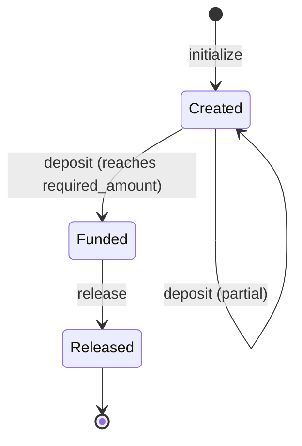

# Escrow contract reference

The `escrow` crate (`contracts/escrow/`) and `escrow_factory` (`contracts/escrow_factory/`) are a standalone, minimal Soroban contract pair for a single buyer/seller escrow with a fixed required amount. **This is architecturally unrelated to the Shade hub's own, independently implemented escrow feature** documented at [Escrow](../concepts/escrow.md) (`contracts/shade/src/components/escrow.rs`). The two crates share no code, no types, and no storage, and there is no cross-contract call between them anywhere in this codebase — see [Hub integration](#hub-integration) for the full picture, including a test in the hub's own suite that is easy to mistake for a real integration but is not one.

## Contract interface

`contracts/escrow/` has no separate `interface.rs`; its public surface is the `#[contractimpl] impl EscrowContract` block in [`contracts/escrow/src/lib.rs`](../../contracts/escrow/src/lib.rs). `contracts/escrow_factory/` is defined the same way in [`contracts/escrow_factory/src/lib.rs`](../../contracts/escrow_factory/src/lib.rs).

> **Warning:** `contracts/escrow/src/test.rs` (1,251 lines) and `contracts/escrow/src/integration_test.rs` (292 lines) exist on disk but are **not** referenced by any `mod` declaration in `lib.rs` (which declares only `mod errors;`). They are dead code — not compiled as part of the crate at all (`cargo test -p escrow` runs 0 unit tests from `src/lib.rs`). They describe a much larger, entirely different API surface (buyer/seller/arbiter/terms/milestones/disputes/deadlines/`init`/`approve_release`/`approve_milestone_release`/`open_dispute`/`resolve_dispute`/`claim_refund`) that does not exist in the actual crate and does not compile against it. The crate's real, live, currently-passing test suite lives in **`contracts/escrow/tests/`** (`test_initialization.rs`, `test_funding.rs`, `test_release.rs` — standard Rust integration-test convention, auto-discovered regardless of `lib.rs` module declarations), confirmed by `cargo test -p escrow`. This page documents only the real `lib.rs` API and its real tests; the orphaned files are noted here only so a reader who greps the crate doesn't mistake them for current behavior.

## States

`EscrowStatus` (`contracts/escrow/src/lib.rs`) has exactly three variants — the issue text's suggested `created → funded → released / refunded / expired` is **not** what this crate implements; there is no `refunded` or `expired` state at all in the standalone crate:

| Variant | Value | Meaning |
|---|---|---|
| `Created` | 0 | Initialized, no funds deposited yet. |
| `Funded` | 1 | `deposited_amount == required_amount`. |
| `Released` | 2 | The buyer has released the escrow. Terminal. |



There is no refund path, no expiry, and no arbitration in this crate — confirmed by reading every function in `lib.rs`: `initialize`, `deposit`, `release`, and five read-only getters (`buyer`, `seller`, `required_amount`, `deposited_amount`, `status`). Nothing else exists.

### Transition reference

| Transition | Function | Caller | Preconditions | Funds movement | Resulting status | Event |
|---|---|---|---|---|---|---|
| Initialize | `initialize` | Anyone (no `require_auth()` call in the function at all) | `required_amount > 0`; not already initialized | None | `Created` | None |
| Deposit (partial) | `deposit` | Anyone (no `require_auth()` call) | Status `Created`; `amount > 0`; `deposited_amount + amount <= required_amount` (else `Overfunded`) | None — this contract does not transfer tokens; `deposit` only records `amount` as a bookkeeping figure | `Created` (unchanged) if still below `required_amount` | None |
| Deposit (reaches full) | `deposit` | Anyone | Same as above, and the running total equals `required_amount` exactly | None (still no token transfer) | `Funded` | None |
| Release | `release` | Buyer | `buyer.require_auth()`; status `Funded` | None — `release` does not call any token contract; it only emits `ReleasedEvent` carrying the amount as a signal | `Released` | `ReleasedEvent` |

> **Warning:** neither `initialize` nor `deposit` calls `require_auth()` on any address in the current implementation — anyone can initialize an escrow instance and anyone can call `deposit` to advance its recorded `deposited_amount`, regardless of whether they are the buyer, the seller, or an unrelated caller. Only `release` enforces that the caller is the stored buyer. This is a genuine gap relative to what a production escrow would typically require, documented here because it's what the source does, not a claim about what it should do.

> **Warning:** `deposit` and `release` do not move any tokens. There is no `TokenClient`/`token::Client` import or call anywhere in `contracts/escrow/src/lib.rs`. `deposited_amount` is a plain `i128` counter the caller supplies as an argument — it is not derived from an actual balance check or transfer. Integrators cannot rely on this contract to custody funds by itself; any real token movement has to happen through a separate mechanism the caller coordinates around this contract's state.

## Initialization

```rust
pub fn initialize(env: Env, buyer: Address, seller: Address, required_amount: i128);
```

- **Auth:** none required.
- **Parameters:** `buyer`, `seller` — plain addresses, no registration check against any merchant/account system. `required_amount` — the target deposit total.
- **Validation:** panics `AlreadyInitialized` if `DataKey::Buyer` is already set (so `initialize` can only run once per contract instance); panics `InvalidAmount` if `required_amount <= 0`.
- **State written:** `Buyer`, `Seller`, `RequiredAmount = required_amount`, `DepositedAmount = 0`, `Status = Created`.
- There is no token address, deadline, agreement/reference ID, or any other constructor parameter — the entire configurable state of an escrow instance is buyer, seller, and required amount.

## Funding

```rust
pub fn deposit(env: Env, amount: i128);
```

Authority: `contracts/escrow/tests/test_funding.rs` plus `lib.rs`.

- **Auth:** none.
- **Validation:** panics `InvalidAmount` if `amount <= 0`; panics `InvalidStatus` if the escrow is not currently `Created` (so no further deposits are accepted once `Funded`); panics `Overflow` if adding `amount` to the running total would overflow `i128`; panics `Overfunded` if the new running total would exceed `required_amount`.
- **Repeated funding is explicitly supported and tested** — `test_multiple_deposits_accumulate` confirms three separate `deposit` calls (200, 300, 500) accumulate to exactly `required_amount` and the status transitions to `Funded` only once the total is reached, not before. `test_partial_deposit_keeps_created_status` confirms a deposit below `required_amount` leaves status at `Created`.
- **No exact-match requirement on a single call** — funding can be split across any number of calls, as long as no individual call plus the running total exceeds `required_amount`.
- **Overpayment is rejected outright** (not accepted-and-refunded) — a call that would push the total over `required_amount` panics `Overfunded` rather than succeeding with excess funds held.
- **No token transfer occurs** — see the warning above.
- No event is published on deposit.

## Release

```rust
pub fn release(env: Env);
```

Authority: `contracts/escrow/tests/test_release.rs` plus `lib.rs`.

- **Auth:** `buyer.require_auth()` — the stored buyer must authorize the call. `test_non_buyer_cannot_release` confirms a caller mocked as the seller cannot release.
- **When:** requires status `Funded`; `test_cannot_release_before_funding` confirms `release` on a `Created` (not yet funded) escrow panics.
- **Required funding state:** exactly `Funded` — there is no partial-release concept.
- **Recipient / amount / token transfer:** `release` does not transfer any token. It publishes a `ReleasedEvent { buyer, seller, amount: deposited_amount }` — the doc comment in source is explicit: *"Minimal MVP behavior: emit release event as transfer signal."* The event is a signal for an off-chain or higher-level process to act on; the contract itself does not move funds.
- **Resulting state:** `Status = Released` — terminal; there is no function that reads or transitions a `Released` escrow further.

## Refund / expiry

**Neither exists in this crate.** There is no `refund` function, no `expired`/`Expired` status, no deadline field on the escrow, and no time-based logic of any kind in `contracts/escrow/src/lib.rs`. An escrow that is `Created` but never funded, or `Funded` but never released, has no mechanism in this contract to return funds or change state — because the contract itself never holds funds in the first place (see the funds-movement warning above), "refund" would in any case have nothing on-contract to reverse.

> **Note:** the orphaned `contracts/escrow/src/integration_test.rs` and `src/test.rs` files describe expiry/`claim_refund` behavior extensively (deadlines, `EXPIRY` constants, "escrow has not expired yet" panics) — but as established above, those files are not compiled into the crate and do not reflect `lib.rs`. Do not treat them as documentation of current behavior. If similarly named tests are needed for reference, `contracts/shade/src/tests/test_expired_escrow_refund.rs` exists, but — despite its name and its `Escrow*`-flavored error/event names — it exercises **invoice** expiry refunds (`claim_refund` on an `Invoice`, part of the hub's invoice component), not this crate or the hub's own `Escrow` type. See the [invoice lifecycle](../concepts/invoice-lifecycle.md#expiry) page for that behavior.

## Arbitration

**Does not exist in this crate.** There is no arbiter address, no dispute function, no dispute state, and no third-party resolution path anywhere in `contracts/escrow/src/lib.rs`. The only two parties recognized by the contract are `buyer` and `seller`; `release` is buyer-authorized and there is no seller-side or third-party override. (The orphaned test files again describe an `arbiter`/`resolve_dispute`/`open_dispute` API that does not exist in the compiled crate — see the warning at the top of this page.)

## Factory: `escrow_factory`

### Interface

#### `initialize`

```rust
pub fn initialize(env: Env, escrow_wasm_hash: BytesN<32>);
```

No `require_auth()` call on any address — this function can be called by anyone, once, per factory instance. Panics `AlreadyInitialized` if `DataKey::EscrowWasmHash` is already set.

#### `deploy_escrow`

```rust
pub fn deploy_escrow(env: Env, buyer: Address, seller: Address, required_amount: i128) -> Address;
```

- **Auth:** none — deployment is permissionless.
- **Address derivation is random, not deterministic.** The exact source:
  ```rust
  let random: BytesN<32> = env.prng().gen();
  let salt = env.crypto().keccak256(&Bytes::from_slice(&env, &random.to_array()));
  let escrow_address = env.deployer().with_current_contract(salt).deploy_v2(wasm_hash, ());
  ```
  The salt comes from on-chain randomness (`env.prng().gen()`), not from `buyer`, `seller`, `required_amount`, or any other deterministic input. There is no way to predict a deployed escrow's address off-chain before the deployment transaction executes; it must be read from the function's return value or from `get_escrows`.
- **Constructor args passed to the deployed contract:** after deployment, the factory calls the new instance's `initialize(buyer, seller, required_amount)` via `invoke_contract` — so a factory-deployed escrow is fully initialized (status `Created`) by the time `deploy_escrow` returns, unlike a manually deployed instance where a separate `initialize` call is needed.
- **State:** appends the new escrow's address to a persisted `Vec<Address>` under `DataKey::Escrows`.
- No event is published by `deploy_escrow`.

#### `get_escrows`

```rust
pub fn get_escrows(env: Env) -> Vec<Address>;
```

Read-only; returns every address the factory has deployed, in deployment order. This is the only lookup mechanism — there is no per-buyer, per-seller, or per-ID indexing, and no way to look up a single escrow's address without scanning this full list.

### Upgrade implications

Like `ticketing_factory` and the hub's `account_factory`, `escrow_factory` deploys whatever WASM hash is currently registered — there is no `set_escrow_wasm_hash` equivalent visible beyond `initialize` itself (the hash is set once, at `initialize`, and there is no function to change it afterward). This means, unlike `ticketing_factory`, **the escrow WASM hash cannot be updated after the factory is initialized** — every escrow this factory ever deploys uses the hash fixed at `initialize` time.

## Errors

### `EscrowError` (`contracts/escrow/src/errors.rs`)

| Error | Value | Trigger |
|---|---|---|
| `AlreadyInitialized` | 1 | `initialize` called on an already-initialized instance. |
| `NotInitialized` | 2 | Any getter or `deposit`/`release` called before `initialize`. |
| `InvalidAmount` | 3 | `initialize` with `required_amount <= 0`; `deposit` with `amount <= 0`. |
| `Overflow` | 4 | `deposit` where `deposited_amount + amount` would overflow `i128`. |
| `Overfunded` | 5 | `deposit` where the new total would exceed `required_amount`. |
| `InvalidStatus` | 6 | `deposit` when status is not `Created`; `release` when status is not `Funded`. |

### `FactoryError` (`contracts/escrow_factory/src/errors.rs`)

| Error | Value | Trigger |
|---|---|---|
| `AlreadyInitialized` | 1 | `initialize` called on an already-initialized factory. |
| `NotInitialized` | 2 | `deploy_escrow`/`get_escrows` called before `initialize`. |

## Hub integration

The Shade hub has its own, entirely separate escrow implementation in `contracts/shade/src/components/escrow.rs`, exposed through `ShadeTrait` as `create_escrow`, `fund_escrow`, `release_escrow`, `refund_escrow`, and fully documented at [Escrow](../concepts/escrow.md). It uses its own `Escrow`/`EscrowStatus` types in `contracts/shade/src/types.rs` (`EscrowStatus { Created, Funded, Released, Refunded }` — four variants, including a `Refunded` state the standalone crate lacks), its own storage keys, and — unlike the standalone crate — it **does** move real tokens: `fund_escrow` transfers from the buyer into the Shade contract itself, `release_escrow` pays the merchant account net of platform fee and the platform account the fee, and `refund_escrow` returns the full amount to the buyer.

Confirmed directly from `contracts/shade/Cargo.toml`: the hub depends only on `account` and `soroban-sdk` — there is no dependency on the standalone `escrow` or `escrow_factory` crates, and no `invoke_contract`/deployment call anywhere in `contracts/shade/src` targets either of them.

> **Note:** `contracts/shade/src/tests/test_escrow_integration.rs` is easy to mistake for evidence of a real integration between the hub and a genuine escrow contract, but it is not one. Reading the file directly: it defines an inline **mock** contract (`mod escrow_mock { ... }`, a `#[contract] pub struct EscrowMock`) purely within the test file, which simulates a hypothetical external caller invoking the hub's own `pay_invoice` via `env.invoke_contract`. It does not deploy, reference, or call the real `contracts/escrow` crate at all, and it does not exercise the hub's own `create_escrow`/`fund_escrow`/`release_escrow`/`refund_escrow` functions either — it is testing that an arbitrary external contract can call `pay_invoice` on the hub, nothing more. `contracts/shade/src/tests/test_expired_escrow_refund.rs` is similarly named but, as covered under [Refund / expiry](#refund--expiry) above, actually tests **invoice** expiry refunds (`claim_refund` on an `Invoice`), not any `Escrow` type.

**For an integrator:** the hub's own escrow functions (`create_escrow`/`fund_escrow`/`release_escrow`/`refund_escrow`) are the only escrow implementation in this codebase that actually custodies and moves tokens, ties into Shade's merchant/platform-fee system, and can be associated with a Shade invoice via the optional `invoice_id` field. The standalone `escrow`/`escrow_factory` crates are a separate, much more minimal, non-token-moving bookkeeping contract with no relationship to Shade's merchant registry, fee system, or invoices — using it in place of the hub's escrow feature means the integrator must independently coordinate any actual token custody and transfer around this contract's state, since the contract does not do so itself.

## Related pages

- [Escrow](../concepts/escrow.md) — the Shade hub's own escrow feature, fully documented (this page intentionally does not repeat that content).
- [Invoice lifecycle and statuses](../concepts/invoice-lifecycle.md#expiry) — `claim_refund` and the `Escrow*`-named errors/events it reuses, which belong to invoice logic, not to either escrow contract on this page.
- [Subscription contract reference](./subscription.md) — the sibling standalone-crate-vs-hub-component pattern for subscriptions.
- [Ticketing contract reference](./ticketing.md) — the sibling standalone-crate-vs-hub pattern for ticketing, including the same random-salt factory idiom.
- [Protocol Glossary](../glossary.md) — `escrow`, `escrow arbiter` terms.
