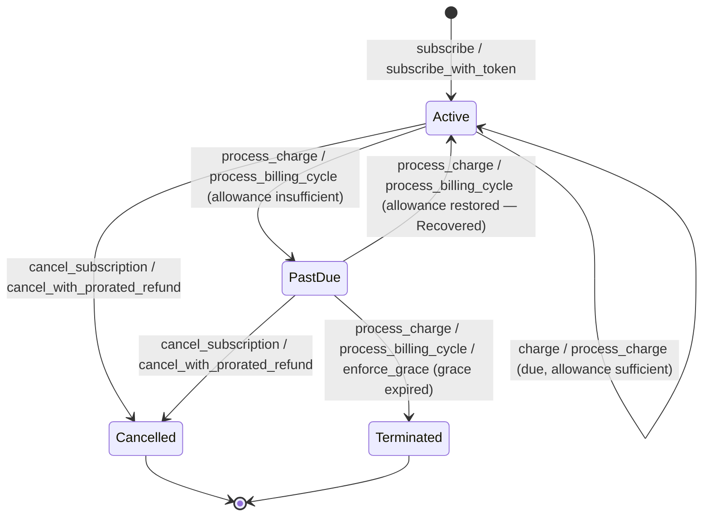

# Subscription contract reference

The `subscription` crate (`contracts/subscription/`) is a standalone Soroban contract implementing recurring billing: merchant-defined plans, customer enrollment, allowance-based charging, a grace-period/termination state machine, prorated refunds, and mid-cycle upgrades/downgrades. It is architecturally independent of the Shade hub's own, much simpler [subscription feature](../concepts/subscriptions.md) (`contracts/shade/src/components/subscription.rs`) — the two share no code, no types, and no runtime calls. See [Relationship to Shade](#relationship-to-shade) below for when to use which.

## Contract interface

`contracts/subscription/` has no separate `interface.rs`; its public surface is the `#[contractimpl] impl SubscriptionContract` block in [`contracts/subscription/src/lib.rs`](../../contracts/subscription/src/lib.rs). All four test modules (`test_grace`, `test_integration`, `test_refund`, `test_upgrades_downgrades`) are wired in via `#[cfg(test)] mod` declarations in `lib.rs` and the crate builds cleanly (`cargo build -p subscription`) — unlike [`contracts/escrow`](./escrow.md), there is no orphaned/stale test code here.

## Types

Defined in [`contracts/subscription/src/types.rs`](../../contracts/subscription/src/types.rs).

### `Plan`

| Field | Type | Meaning | Controlled by |
|---|---|---|---|
| `id` | `u64` | Sequential, 1-based plan ID. | Contract |
| `merchant` | `Address` | The plan owner. | Merchant, at creation |
| `description` | `String` | Free-text description. | Merchant |
| `token` | `Address` | Billing token; must be in `AcceptedTokens`. | Merchant |
| `amount` | `i128` | Amount charged per interval, in token base units. | Merchant, mutable via `update_plan_amount` |
| `interval` | `u64` | Billing interval in seconds. | Merchant, mutable via `update_plan_interval` |
| `active` | `bool` | Whether new subscriptions may enroll. | Merchant, via `deactivate_plan` (one-way to `false`) |
| `created_at` | `u64` | Ledger timestamp at plan creation. | Contract |
| `grace_period` | `u64` | Seconds a subscription may stay `PastDue` before termination. `0` = no grace. | Merchant, via `set_plan_grace_period` |
| `creator` | `Option<Address>` | If set, charges and refunds route to this address instead of `merchant`. | Merchant, at creation |
| `trial_period` | `u64` | Seconds after `created_at` (subscription-level, via first-charge gating) before the first charge is permitted. | Merchant, at creation |

`update_plan_amount`/`update_plan_interval` do not retroactively affect subscriptions already mid-cycle — the new value applies from the next computed charge.

### `Subscription`

| Field | Type | Meaning | Controlled by |
|---|---|---|---|
| `id` | `u64` | Sequential subscription ID. | Contract |
| `plan_id` | `u64` | The enrolled plan. | Contract, changes on upgrade/deferred downgrade |
| `customer` | `Address` | The subscriber. | Customer, at `subscribe` |
| `status` | `SubscriptionStatus` | Current lifecycle state. | Contract |
| `created_at` | `u64` | Ledger timestamp at enrollment. | Contract |
| `last_charged` | `u64` | Timestamp of the last successful charge. `0` means never charged. | Contract |
| `past_due_since` | `u64` | Timestamp the subscription entered `PastDue`. `0` if not currently past due. | Contract |
| `pending_downgrade_plan_id` | `u64` | Non-zero if a downgrade is scheduled but not yet applied. | Contract, via `downgrade_subscription` |
| `preferred_token` | `Option<Address>` | Overrides the plan's default billing token for this subscription. | Customer, via `subscribe_with_token`/`set_preferred_token` |

### `SubscriptionStatus`

| Variant | Value | Meaning |
|---|---|---|
| `Active` | 0 | Can be charged. |
| `Cancelled` | 1 | Customer- or merchant-cancelled; terminal, cannot be charged or recovered. |
| `PastDue` | 2 | A charge attempt failed; subscription is inside the plan's grace window. A fresh allowance restores it to `Active`. |
| `Terminated` | 3 | Grace window expired without payment; terminal, cannot be charged or recovered. |

### `ChargeOutcome`

Returned by `process_charge`/`process_billing_cycle`:

| Variant | Value | Meaning |
|---|---|---|
| `Charged` | 0 | Charge succeeded. |
| `NotDueYet` | 1 | Interval/trial has not elapsed. |
| `EnteredGrace` | 2 | Charge failed (insufficient allowance); subscription moved to `PastDue`. |
| `Recovered` | 3 | A previously `PastDue` subscription was successfully charged and returned to `Active`. |
| `Terminated` | 4 | Grace window expired during this call; subscription moved to `Terminated`. |
| `Skipped` | 5 | Only from `process_billing_cycle` — the subscription is already `Cancelled`/`Terminated`. `process_charge` panics instead of returning this. |

## Lifecycle



This diverges from a naive "create plan → subscribe → charge → renew → grace period → lapse/cancel" assumption in two ways verified directly from `lib.rs` and `test_grace.rs`: strict `charge()` has **no grace awareness at all** — it panics on a `PastDue` subscription rather than entering or continuing grace; only `process_charge`/`process_billing_cycle`/`enforce_grace` drive the `PastDue`/`Terminated` machine. And "lapse" and "cancel" are two distinct terminal states (`Terminated` vs `Cancelled`), not one lapse/cancel outcome — neither can transition to the other or be recovered.

### Transition reference

| Transition | Function | Caller | Preconditions | Funds movement | Event |
|---|---|---|---|---|---|
| Create plan | `create_plan` | Merchant | `amount > 0`, `interval != 0`, token accepted | None | — |
| Subscribe | `subscribe` / `subscribe_with_token` | Customer | Plan `active` | None (allowance authorized separately via `authorize_billing`) | — |
| Strict charge | `charge` | Anyone (no customer auth check on caller) | Status `Active`; due per interval or trial; sufficient allowance | Customer → `plan.creator.unwrap_or(plan.merchant)` | `SubRenewed` |
| Forgiving charge (success) | `process_charge` / `process_billing_cycle` | Anyone | Status `Active` or `PastDue`; due; allowance sufficient | Customer → creator/merchant | `SubRenewed` |
| Enter grace | `process_charge` / `process_billing_cycle` | Anyone | Status `Active`; due; allowance insufficient; `grace_period > 0` | None | — |
| Recover from grace | `process_charge` / `process_billing_cycle` | Anyone | Status `PastDue`; allowance now sufficient | Customer → creator/merchant | `SubRenewed` |
| Terminate | `process_charge` / `process_billing_cycle` / `enforce_grace` | Anyone | Status `PastDue`; `now > past_due_since + grace_period` | None | `SubExpired` |
| Cancel | `cancel_subscription` | Customer or plan's merchant | Status `Active` or `PastDue` | None (if customer-initiated, the customer's token allowance to this contract is also zeroed in the same call) | `SubExpired` |
| Cancel with refund | `cancel_with_prorated_refund` | Customer, merchant, or `plan.creator`; the non-initiating party (funds source or customer) must also authorize | Status `Active` or `PastDue`; prorated refund `> 0` | `plan.creator.unwrap_or(plan.merchant)` → customer, prorated amount | `SubExpired` |
| Upgrade | `upgrade_subscription` | Customer | Status `Active`; new plan `active` and same token | Customer → creator/merchant, `new_plan.amount - prorated_refund(old_plan)` (floored at 0) | `SubRenewed` |
| Downgrade (scheduled) | `downgrade_subscription` | Customer | Status `Active`; new plan `active` and same token | None (deferred) | — |
| Downgrade (applied) | Next `charge` / `process_charge` after scheduling | — | `pending_downgrade_plan_id != 0` | Plan swapped before computing the charge amount; then charged normally at the new (lower) amount | Whatever the triggering charge emits |

`enforce_grace` is a no-op (returns without panicking) if the subscription is already `Terminated`, panics `GraceNotExpired` if called before the window has elapsed, and panics `SubscriptionNotActive` if the subscription isn't currently `PastDue`. It requires no authorization — anyone may call it once the grace window has genuinely expired.

## Billing authorization

Unlike the hub's `charge_subscription`, this crate relies on a standard token allowance rather than a bespoke payment route:

- `authorize_billing(customer, sub_id, cycles)` — customer-authorized. Computes `allowance_amount = plan.amount.saturating_mul(cycles)` and an allowance expiration ledger of roughly `current_sequence + 17_280 * cycles` (approximately one day of ledger closes per cycle — this is a fixed approximation, **not** derived from `plan.interval`, so a plan with a much longer or shorter interval than one day may see the allowance expire earlier or later than the cycles it was meant to cover). Calls the token contract's `approve`.
- `get_billing_allowance(customer, sub_id)` — reads the live token allowance.
- `revoke_billing_authorization(customer, sub_id)` — customer-authorized, zeroes the allowance without changing subscription status.

## Grace period

Authority: `test_grace.rs` plus the `PastDue`/`Terminated` handling in `lib.rs`.

- **Default is `0`** (no grace) unless the merchant calls `set_plan_grace_period` — with `grace_period == 0`, the very first failed charge terminates the subscription immediately (no `PastDue` stopover).
- **Begins** the moment a charge attempt fails while the subscription is `Active` and `grace_period > 0`: status becomes `PastDue`, `past_due_since` is set to the timestamp of that failed attempt (not the original due date).
- **Length** is exactly `plan.grace_period` seconds from `past_due_since`. Repeated failed pokes during the window do not reset or extend `past_due_since`.
- **What remains available during grace:** the subscription can still be read (`get_subscription`), and can be cancelled (`cancel_subscription`/`cancel_with_prorated_refund` both accept `PastDue`) without first recovering.
- **Recovery:** if the customer restores sufficient token allowance before the window elapses, the next `process_charge`/`process_billing_cycle` call pulls the charge, sets `status = Active`, `last_charged = now`, `past_due_since = 0`, and returns `Recovered`.
- **At expiration** (`now > past_due_since + grace_period`, still insufficient allowance), the subscription becomes `Terminated` — final, unrecoverable, and un-chargeable. This can be driven by another `process_charge`/`process_billing_cycle` call or by the permissionless `enforce_grace`.
- Strict `charge()` is **not grace-aware**: it panics `SubscriptionNotActive` if called on a `PastDue` subscription rather than entering, continuing, or resolving grace.

## Refunds

Authority: `test_refund.rs` plus `prorated_refund` in `lib.rs`.

### Formula

```
if last_charged == 0:            refund = 0   // never charged
cycle_end = last_charged + interval
if now >= cycle_end:              refund = 0   // cycle fully consumed
remaining = cycle_end - now
refund = (plan.amount * remaining) / interval  // floor division
```

Verified against `test_refund.rs`: refund equals the full `plan.amount` immediately after a charge, roughly half at the cycle midpoint (within integer-division tolerance), decreases monotonically through the cycle, and is `0` once a full cycle has elapsed since the last charge.

### Mechanics

- **Who triggers it:** `cancel_with_prorated_refund`, callable by the customer, the plan's merchant, or `plan.creator`. The party that did *not* initiate the call must also authorize — a customer-initiated refund additionally requires the funds source (`creator`/`merchant`) to authorize, and vice versa, since the funds move via `transfer_from`.
- **Preview:** `quote_prorated_refund(sub_id)` runs the same formula read-only, with no authorization required.
- **Partial refunds:** the formula itself is inherently partial/prorated — there is no separate "full refund" vs. "partial refund" function; the amount returned by the formula *is* the refund, computed from remaining time in the current cycle.
- **Destination of funds:** pulled via `token_client.transfer_from(spender, source, customer, refund_amount)` where `source = plan.creator.unwrap_or(plan.merchant)` — the same address that receives charges. This requires the source to have **pre-approved the contract** for at least the refund amount; `test_refund_panics_without_merchant_allowance` confirms the call panics otherwise.
- **Fee handling:** none. The standalone crate deducts no platform fee anywhere in the charge or refund path — 100% of `plan.amount` moves to `plan.creator.unwrap_or(plan.merchant)` and refunds are for the full prorated amount with no fee retained.
- **Resulting state:** `status = Cancelled` (the same terminal state as a plain `cancel_subscription`), `SubExpired` emitted. Unlike a customer-initiated `cancel_subscription`, this path does **not** additionally zero the customer's token allowance.
- **Failure modes:** panics `NothingToRefund` if the computed amount is `<= 0`; panics if the subscription is already `Cancelled` or `Terminated` (no double-cancel, no refund on a terminated subscription); panics `NotAuthorized` for an unrelated caller.
- **Works from `PastDue`:** both `cancel_subscription` and `cancel_with_prorated_refund` accept a `PastDue` subscription, letting a customer exit mid-grace without first recovering.

## Errors

`SubscriptionError` (`contracts/subscription/src/errors.rs`):

| Error | Value | Trigger | Operation |
|---|---|---|---|
| `AlreadyInitialized` | 1 | `initialize` called a second time. | `initialize` |
| `NotInitialized` | 2 | Any admin-gated call before `initialize`. | `require_admin` |
| `NotAuthorized` | 3 | Caller is not the plan's merchant, the subscription's customer, or (for refund) not one of customer/merchant/creator. | Plan and subscription management |
| `InvalidAmount` | 4 | `amount <= 0` at plan creation or `update_plan_amount`. | `create_plan`, `update_plan_amount` |
| `InvalidInterval` | 5 | `interval == 0` at plan creation or `update_plan_interval`. | `create_plan`, `update_plan_interval` |
| `PlanNotFound` | 6 | Unknown `plan_id`. | Plan reads/writes |
| `PlanNotActive` | 7 | `subscribe`/`subscribe_with_token`/upgrade/downgrade target an inactive plan. | Enrollment, upgrade, downgrade |
| `SubscriptionNotFound` | 8 | Unknown `sub_id`. | Subscription reads/writes |
| `SubscriptionNotActive` | 9 | Operation requires `Active` (or `Active`/`PastDue` where noted) but the subscription is in a disallowed status — including `Terminated`/`Cancelled` rejections and strict `charge()` on `PastDue`. | `charge`, `process_charge`, `cancel_subscription`, `cancel_with_prorated_refund`, `enforce_grace` |
| `ChargeTooEarly` | 10 | Called before the interval (or trial period, for the first charge) has elapsed. | `charge`, `process_charge`/`process_billing_cycle` (returns `NotDueYet` instead of panicking in the forgiving path) |
| `InsufficientAllowance` | 11 | Strict `charge()` finds the token allowance below `plan.amount`; also raised by `upgrade_subscription` if the upgrade cost exceeds the allowance. | `charge`, `upgrade_subscription` |
| `TokenNotAccepted` | 12 | Plan/subscription token, or an upgrade/downgrade target plan's token, is not in `AcceptedTokens`, or (for upgrade/downgrade) the target plan's token differs from the current plan's token. | `create_plan`, `subscribe_with_token`, `set_preferred_token`, `upgrade_subscription`, `downgrade_subscription` |
| `SubscriptionTerminated` | 13 | Declared but **not raised anywhere** in `lib.rs` as of this writing — `SubscriptionNotActive` is used for terminated-state rejections instead. | — (reserved/unused) |
| `GraceNotExpired` | 14 | `enforce_grace` called before `now > past_due_since + grace_period`. | `enforce_grace` |
| `NothingToRefund` | 15 | Computed prorated refund is `<= 0`. | `cancel_with_prorated_refund` |

## Relationship to Shade

The standalone `subscription` crate and the Shade hub's own subscription feature (`contracts/shade/src/components/subscription.rs`, exposed through `ShadeTrait` as `create_subscription_plan`, `subscribe`, `charge_subscription`, `cancel_subscription`, `deactivate_plan` — documented in full at [Subscriptions and recurring billing](../concepts/subscriptions.md)) are **two separate, independently maintained implementations with no code, type, or storage sharing, and no cross-contract calls in either direction**. `contracts/subscription/Cargo.toml` has no dependency on `shade`, and `contracts/shade/Cargo.toml` depends only on `account` — neither crate references the other, and there is no `subscription_factory` crate (unlike `escrow`/`ticketing`/`crowdfund`, which each have a factory counterpart).

The two implementations diverge substantially, not just in surface API:

| Capability | Standalone `subscription` crate | Shade hub component |
|---|---|---|
| Grace period / `PastDue` / `Terminated` | Yes, full state machine | No — only `Active`/`Cancelled` exist |
| Batch/crank billing (`process_billing_cycle`) | Yes | No — `charge_subscription` is called per-subscription |
| Prorated refunds | Yes (`cancel_with_prorated_refund`, `quote_prorated_refund`) | No |
| Upgrade/downgrade between plans | Yes (`upgrade_subscription`, `downgrade_subscription`) | No |
| Trial periods | Yes (`Plan::trial_period` gates the first charge) | No |
| Multi-token preference per subscription | Yes (`subscribe_with_token`, `preferred_token`) | No — always the plan's token |
| Platform fee split on each charge | No — 100% goes to `plan.creator.unwrap_or(plan.merchant)` | Yes, via `platform_fee::route_from_allowance` |
| Merchant transaction history integration | No | Yes, via `history::record_transaction` |
| Merchant identity | Plain `Address` | Numeric `merchant_id` resolved through the hub's registered-merchant system |

**Neither implementation is "authoritative" over the other — they are parallel systems**, and the code establishes no delegation or wrapping relationship between them. For an integrator building against Shade:

- Use the **Shade hub's own subscription functions** (`create_subscription_plan`/`subscribe`/`charge_subscription`/`cancel_subscription`/`deactivate_plan`) when billing needs to participate in Shade's merchant registry, platform fee split, and transaction-history/analytics — i.e. when the subscription is one more payment surface alongside Shade's invoices, escrow, and events, settled and reported through the same hub.
- Use the **standalone `subscription` contract** when the integration needs grace periods, prorated refunds, plan upgrades/downgrades, trial periods, or permissionless batch billing via `process_billing_cycle` — capabilities the hub component does not implement at all — and does not need Shade's merchant registry or platform fee routing for this billing relationship. Because it is a separate, independently deployed contract, integrating with it means tracking its own contract address and calling it directly; Shade provides no lookup, deployment, or wrapper for it.

## Related pages

- [Subscriptions and recurring billing](../concepts/subscriptions.md) — the Shade hub's own subscription feature, documented in full (this page intentionally does not repeat that content).
- [Escrow contract reference](./escrow.md) — the sibling standalone-crate-vs-hub-component pattern for escrow.
- [Protocol Glossary](../glossary.md) — `merchant`, `subscription`, `subscription plan` terms.
