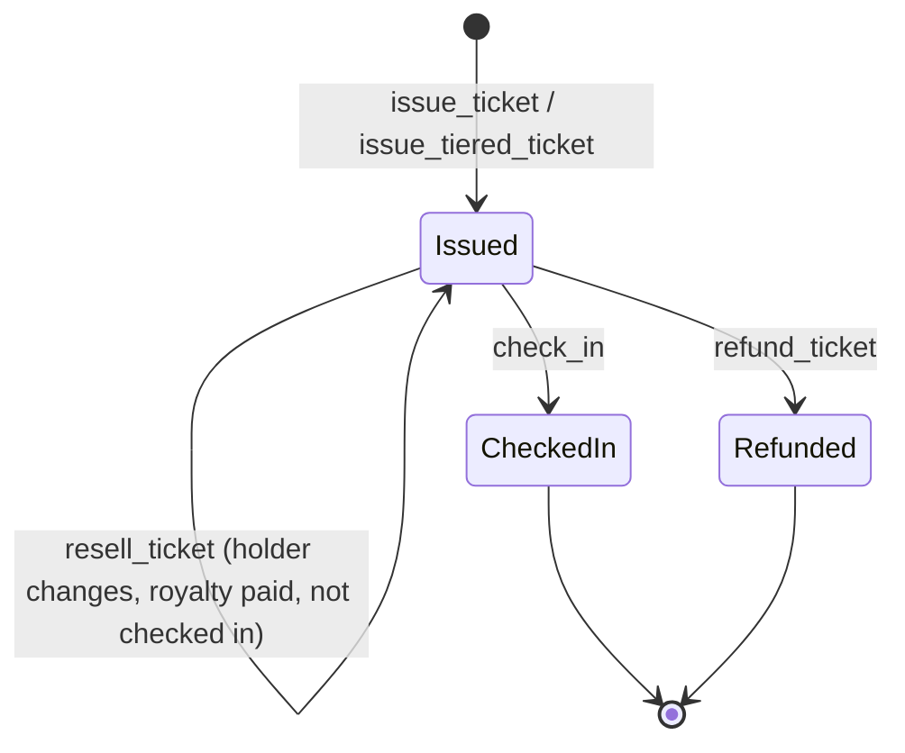

# Ticketing contract reference

The `ticketing` crate (`contracts/ticketing/`) and its `ticketing_factory` (`contracts/ticketing_factory/`) are a standalone Soroban contract pair implementing QR-code check-in, tiered ticket issuance, waitlists, and secondary-market resale with royalties. **This is a separate system from the Shade hub's own built-in ticketing feature** documented at [Event ticketing, dynamic pricing, and resale](../concepts/event-ticketing.md) (`contracts/shade/src/components/event.rs`). The two share no code, no types, and no storage, and there is no cross-contract call between them anywhere in this codebase — see [Relationship to Shade](#relationship-to-shade) for how they differ and when to use each.

## Contract interface

`contracts/ticketing/` has no separate `interface.rs`; its public surface is the `#[contractimpl] impl TicketingContract` block in [`contracts/ticketing/src/lib.rs`](../../contracts/ticketing/src/lib.rs). `contracts/ticketing_factory/` is similarly defined in [`contracts/ticketing_factory/src/lib.rs`](../../contracts/ticketing_factory/src/lib.rs).

`lib.rs` declares `mod test_integration;`, `mod test_resale;`, and `mod test_tiers;` under `#[cfg(test)]`, and all three build and run. `contracts/ticketing/src/test.rs` (632 lines) exists on disk but is **not** referenced by any `mod` declaration — like the orphaned tests in [`contracts/escrow`](./escrow.md), it is dead code, not compiled as part of the crate, and its assertions are not cited here as verified behavior. `contracts/ticketing_factory/src/test.rs` **is** wired in via `mod test;` and does compile.

## Ticket lifecycle and ownership

A single caption for the diagram below: this shows one ticket's possible states from issuance through check-in, transfer/resale, or refund, as implemented across `issue_ticket`/`issue_tiered_ticket`, `transfer_ticket`, `resell_ticket`, `check_in`, and `refund_ticket` in `contracts/ticketing/src/lib.rs`.



Ownership (`Ticket.holder`) can change any number of times via `transfer_ticket` (no payment) or `resell_ticket` (payment plus royalty split) as long as the ticket is not yet checked in — `TicketAlreadyCheckedIn` blocks both once `check_in` has run. `check_in` and `refund_ticket` are each one-way: there is no un-check-in and no un-refund function. A `refund_ticket` call can trigger a **second** ticket's `[*] --> Issued` transition if the event has a non-empty waitlist (see [Cancellation and refunds](#cancellation-and-refunds)), but that is a new ticket, not a resurrection of the refunded one.

## Types

Defined in `contracts/ticketing/src/lib.rs` (there is no separate `types.rs` in this crate).

### `Event`

| Field | Type | Meaning |
|---|---|---|
| `event_id` | `u64` | Sequential event ID. |
| `organizer` | `Address` | The address that created the event and controls it. |
| `name` | `String` | Event name. |
| `description` | `String` | Event description. |
| `start_time` | `u64` | Ledger timestamp the event starts. |
| `end_time` | `u64` | Ledger timestamp the event ends; must be `>= start_time` (else `InvalidTimeRange`). |
| `max_capacity` | `Option<u64>` | Overall ticket cap. `None` means unbounded. |
| `state` | `EventState` | `Active` or `Cancelled`. |

### `Ticket`

| Field | Type | Meaning |
|---|---|---|
| `ticket_id` | `u64` | Sequential ticket ID. |
| `event_id` | `u64` | The event this ticket belongs to. |
| `holder` | `Address` | Current owner. |
| `qr_hash` | `BytesN<32>` | Unique check-in hash for this ticket; deduplicated per event. |
| `checked_in` | `bool` | Whether the ticket has been checked in. |
| `check_in_time` | `Option<u64>` | Timestamp of check-in, if any. |
| `tier_id` | `Option<u64>` | The pricing tier this ticket was issued under. `None` for a ticket issued via the untiered `issue_ticket` path. |
| `refunded` | `bool` | Whether this ticket has been refunded. |

### `Tier`

| Field | Type | Meaning |
|---|---|---|
| `tier_id` | `u64` | Sequential tier ID (per contract instance, not per event). |
| `event_id` | `u64` | The event this tier belongs to. |
| `name` | `String` | Tier name. |
| `price` | `i128` | Informational price in token base units. **Not charged by this contract** — no function in `lib.rs` transfers tokens at issuance; see [`issue_tiered_ticket`](#issue_tiered_ticket) below. |
| `max_supply` | `u64` | Maximum tickets issuable under this tier. |
| `sold` | `u64` | Tickets issued so far under this tier. |

### `ResaleConfig`

| Field | Type | Meaning |
|---|---|---|
| `event_id` | `u64` | The event this resale configuration applies to. |
| `payment_token` | `Address` | Token used for resale payments. |
| `royalty_bps` | `u32` | Royalty owed to the organizer per resale, in basis points of the sale price. Must be `<= 10_000`. |

### Other types

`CheckInRecord { ticket_id, checked_in_by, check_in_time }`, `TicketVerification { ticket_id, event_id, holder, valid, already_checked_in }`, `WaitlistEntry { event_id, applicant, joined_at }`, and `EventState { Active, Cancelled }`.

> **Note:** this crate's `Event`/`Ticket` types are structurally unrelated to the Shade hub's own `Event`/`Ticket` types in `contracts/shade/src/types.rs`. The hub's versions carry `ticket_price`, `sold`, and dynamic-pricing fields; this crate's versions carry `qr_hash`, `checked_in`, and `tier_id`. They are independent, parallel data models, not shared or convertible.

## Public interface

### Event creation and configuration

#### `create_event`

```rust
pub fn create_event(env: Env, organizer: Address, name: String, description: String, start_time: u64, end_time: u64, max_capacity: Option<u64>) -> u64;
```

- **Auth:** `organizer.require_auth()`.
- **Preconditions:** `end_time >= start_time` (else `InvalidTimeRange`).
- **State:** creates a new `Event` in `Active` state with a sequential `event_id`.
- **Events:** `EventCreatedEvent`.

#### `cancel_event`

```rust
pub fn cancel_event(env: Env, organizer: Address, event_id: u64);
```

- **Auth:** `organizer.require_auth()`, and caller must be the event's organizer.
- **Preconditions:** event must currently be `Active` (double-cancel panics `EventCancelled`).
- **State:** `Event.state = Cancelled`.
- **Events:** `EventCancelledEvent`.
- Once cancelled, `issue_ticket`/`issue_tiered_ticket` for that event panic with `EventCancelled`.

#### `add_tier`

```rust
pub fn add_tier(env: Env, organizer: Address, event_id: u64, name: String, price: i128, max_supply: u64) -> u64;
```

- **Auth:** `organizer.require_auth()`, and caller must be the event's organizer.
- **Preconditions:** `max_supply > 0` (else `InvalidTierSupply`); `price >= 0` (else `InvalidTierPrice` — **zero is allowed**, for free-admission tiers); if the event has `max_capacity: Some(cap)`, the sum of all tiers' `max_supply` on that event (including this new one) must not exceed `cap` (else `TierAtCapacity`). If `max_capacity` is `None`, tier supply is unbounded.
- **State:** new `Tier` with `sold: 0`.
- **Events:** `TierCreatedEvent`.
- **No function exists to modify a tier's price or supply after creation** — tiers are immutable once added except for the internal `sold` counter.

#### `set_resale_config`

```rust
pub fn set_resale_config(env: Env, organizer: Address, event_id: u64, payment_token: Address, royalty_bps: u32);
```

- **Auth:** `organizer.require_auth()`, and caller must be the event's organizer.
- **Preconditions:** `royalty_bps <= 10_000` (else `InvalidRoyaltyBps`).
- **State:** overwrites any existing `ResaleConfig` for the event (last call wins).
- **Events:** `ResaleConfiguredEvent`.

### Ticket issuance

#### `issue_ticket`

```rust
pub fn issue_ticket(env: Env, organizer: Address, event_id: u64, holder: Address, qr_hash: BytesN<32>) -> u64;
```

- **Auth:** `organizer.require_auth()`, and caller must be the event's organizer.
- **Preconditions:** event must be `Active`; if `max_capacity` is set, the event must not be at capacity (else `EventAtCapacity`); `qr_hash` must not already be used on this event (else `DuplicateQRHash`).
- **State:** new untiered `Ticket` (`tier_id: None`).
- **Events:** `TicketIssuedEvent`.
- **This is an organizer-controlled mint, not a purchase** — no token transfer occurs. The organizer decides who receives a ticket; there is no buyer-initiated, payment-gated issuance function in this crate.

#### `issue_tiered_ticket`

```rust
pub fn issue_tiered_ticket(env: Env, organizer: Address, event_id: u64, holder: Address, qr_hash: BytesN<32>, tier_id: u64) -> u64;
```

- Same auth/duplicate-QR/capacity rules as `issue_ticket`, plus: `tier_id` must belong to `event_id` (else `TierEventMismatch`), and the tier must not be sold out (`tier.sold >= tier.max_supply` panics `TierAtCapacity`) **even if the overall event still has capacity** — a tier can sell out independently of the event cap.
- **State:** new `Ticket` with `tier_id: Some(tier_id)`; increments `Tier.sold`.
- Like `issue_ticket`, this mints without moving tokens — `Tier.price` is informational only and is not charged here.

### Ownership and transfer

#### `transfer_ticket`

```rust
pub fn transfer_ticket(env: Env, current_holder: Address, ticket_id: u64, new_holder: Address);
```

- **Auth:** `current_holder.require_auth()`, and caller must be the ticket's current `holder`.
- **Preconditions:** ticket must not be checked in (else `TicketAlreadyCheckedIn`).
- **State:** `Ticket.holder = new_holder`. No token transfer.
- **Events:** `TicketTransferedEvent` (event name as defined in source, including its spelling).

#### `check_in`

```rust
pub fn check_in(env: Env, operator: Address, ticket_id: u64);
```

- **Auth:** `operator.require_auth()`, **and** the caller must literally be the event's organizer — `require_auth()` alone is not sufficient; there is a separate `is_event_organizer` check.
- **Preconditions:** ticket must not already be checked in (else `AlreadyCheckedIn`).
- **State:** `Ticket.checked_in = true`, `check_in_time = Some(now)`; writes a `CheckInRecord`.
- **Events:** `TicketCheckedInEvent`.

#### `verify_ticket`

```rust
pub fn verify_ticket(env: Env, ticket_id: u64, qr_hash: BytesN<32>) -> TicketVerification;
```

Read-only. Returns whether the supplied `qr_hash` matches the ticket and whether it is already checked in — no auth, no state change.

### Resale

#### `resell_ticket`

```rust
pub fn resell_ticket(env: Env, seller: Address, buyer: Address, ticket_id: u64, sale_price: i128);
```

- **Auth:** **both** `seller.require_auth()` and `buyer.require_auth()` — the buyer's authorization is required because the underlying token transfer requires it.
- **Preconditions:** `sale_price > 0` (else `InvalidResalePrice`); `seller != buyer` (else `SameHolder`); a `ResaleConfig` must exist for the ticket's event (else `ResaleNotConfigured`); the ticket must not be checked in (else `TicketAlreadyCheckedIn`); `seller` must be the ticket's current `holder` (else `NotAuthorized`).
- **Funds flow, traced directly from the token calls and confirmed by `test_resale.rs`'s balance assertions (not inferred from names):**
  ```
  royalty         = sale_price * royalty_bps / 10_000   (integer division)
  seller_proceeds = sale_price - royalty
  ```
  The royalty is paid to `event.organizer` (looked up fresh from the `Event` record at resale time) and `seller_proceeds` to the seller, both in `ResaleConfig.payment_token` — which is not necessarily the token used at original issuance, since issuance never moves tokens in this crate.
  - `royalty_bps = 0` pays the seller in full; `royalty_bps = 10_000` (100%) pays the organizer in full and the seller nothing.
  - Because royalty uses floor division, a tiny `sale_price` combined with a low `royalty_bps` can floor the royalty to `0`, paying the seller the full amount — confirmed by `test_resale.rs` as an accepted consequence of basis-point math on small amounts, not a bug.
- **State:** `Ticket.holder = buyer`.
- **Multiple resales are supported** — `test_resale.rs` chains seller → buyer → buyer2 → buyer3 across three separate `resell_ticket` calls, each paying royalty independently and each updating `holder` correctly; there is no "already resold once" restriction.
- **No separate platform fee exists** in this contract — only the single seller/organizer royalty split. There is no third-party fee recipient.
- **Events:** `TicketResoldEvent`, carrying `sale_price`, `royalty`, `seller_proceeds`, and `payment_token`.

### Cancellation and refunds

#### `refund_ticket`

```rust
pub fn refund_ticket(env: Env, holder: Address, ticket_id: u64);
```

- **Auth:** `holder.require_auth()`, and caller must be the ticket's current holder.
- **Preconditions:** ticket must not already be refunded (else `TicketAlreadyRefunded`); a checked-in ticket cannot be refunded (`AlreadyCheckedIn`).
- **State:** `Ticket.refunded = true`; removes the ticket from the event's active ticket list, freeing one capacity slot.
- If the event's waitlist is non-empty, the FIFO front entry is automatically popped and minted a new untiered ticket via an internal helper (using a placeholder QR hash derived from the ticket ID and timestamp — a placeholder an integrator is expected to replace with a real QR value off-chain), publishing `WaitlistAssignedEvent`.
- **Events:** `TicketRefundedEvent`, and `WaitlistAssignedEvent` if a waitlisted applicant was promoted.
- **No token transfer occurs** — like issuance, this contract does not itself move funds on refund; there is no charge to refund in the first place since tickets are minted, not sold, at issuance.
- **No test in this crate exercises `refund_ticket`** — this is verified but untested behavior; treat it as implemented-but-unvalidated.

#### `join_waitlist`

```rust
pub fn join_waitlist(env: Env, event_id: u64, applicant: Address) -> u32;
```

- **Auth:** `applicant.require_auth()`.
- **Preconditions:** the event must have `max_capacity: Some(_)` and currently be at or over that capacity (else `NotAtCapacity` — an event with unbounded capacity, or one with room remaining, cannot accept waitlist entries); the applicant must not already be on the waitlist for this event (else `AlreadyOnWaitlist`).
- **State:** appends a `WaitlistEntry` to the event's FIFO waitlist.
- **Events:** `WaitlistJoinedEvent`.
- Like `refund_ticket`, **no test in this crate exercises `join_waitlist` or `get_waitlist`** — verified from source but not covered by the wired test suite.

### Queries

`get_event`, `get_ticket`, `get_tier`, `get_event_tiers`, `get_event_tickets`, `get_waitlist`, `get_check_in_record`, `get_event_ticket_count`, `get_event_checked_in_count`, `get_resale_config` — all read-only, no authorization required, panicking on missing IDs where relevant (`EventNotFound`, `TicketNotFound`, `TierNotFound`, `ResaleNotConfigured` for `get_resale_config`).

## Tiered pricing

Tier definition, capacity, and issuance follow directly from `add_tier`/`issue_tiered_ticket` above and are cross-checked against `test_tiers.rs`:

- Tier IDs are sequential **per contract instance**, not per event.
- A tier's `sold` count is tracked independently per tier — two tiers on the same event do not share a counter.
- Combined tier supply is capped by the event's `max_capacity` only if that cap is set; an event with `max_capacity: None` can have tiers of any total size.
- A tier can be exhausted (`TierAtCapacity`) even while the event as a whole still has room — tier capacity and event capacity are enforced independently, and hitting either blocks further issuance under that tier.
- **Tiers cannot be modified after creation** — there is no update/edit function for a tier's `price` or `max_supply` in `lib.rs`.
- Ordering/priority between tiers is not implemented — the contract has no concept of tier ranking or purchase priority beyond independent capacity checks.

## Factory: `ticketing_factory`

### Types

```rust
pub struct EventRef {
    pub ref_id: u64,
    pub contract: Address,
    pub organizer: Address,
    pub deployed_at: u64,
}
```

### Interface

#### `initialize`

```rust
pub fn initialize(env: Env, admin: Address);
```

One-shot; `admin.require_auth()`; panics `AlreadyInitialized` if already set.

#### `set_ticketing_wasm_hash`

```rust
pub fn set_ticketing_wasm_hash(env: Env, admin: Address, wasm_hash: BytesN<32>);
```

Admin-only (compared against the stored admin address; `NotAuthorized` otherwise). Sets the WASM hash the factory deploys on subsequent calls.

#### `deploy_event_contract`

```rust
pub fn deploy_event_contract(env: Env, organizer: Address) -> EventRef;
```

- **Auth:** `organizer.require_auth()` — deployment itself is permissionless to any caller; only setting the WASM hash is admin-gated.
- **Preconditions:** `set_ticketing_wasm_hash` must have been called at least once (else `WasmHashNotSet`).
- **Address derivation is random, not deterministic.** The exact source:
  ```rust
  let random: BytesN<32> = env.prng().gen();
  let salt = env.crypto().keccak256(&Bytes::from_slice(&env, &random.to_array()));
  let deployed = env.deployer().with_current_contract(salt).deploy_v2(wasm_hash, ());
  ```
  The salt comes from on-chain randomness (`env.prng().gen()`), not from `event_id`, `organizer`, or any other deterministic input — this mirrors the same pattern used by the hub's own `account_factory::deploy_account`. There is **no way to predict a ticketing contract's address off-chain before deployment**; an integrator must read it back from the returned `EventRef` or from `EventContractDeployedEvent`.
  - No constructor arguments are passed to the deployed contract (`deploy_v2(wasm_hash, ())`) — `TicketingContract` has no `initialize` function; all of its state is created lazily per-call (per-event, per-ticket), consistent with there being no init step here.
- **State:** stores a new `EventRef` at a sequential `ref_id`.
- **Events:** `EventContractDeployedEvent { ref_id, contract, organizer, timestamp }`.

#### Lookup

`get_event_ref(ref_id)` (panics `EventRefNotFound` if missing), `get_event_ref_count()`, `get_all_event_refs()` (linear scan over all stored refs).

### Upgrade implications

Because `deploy_event_contract` deploys whatever WASM hash is currently set via `set_ticketing_wasm_hash`, changing that hash only affects contracts deployed *after* the change — already-deployed per-event contracts are not upgraded retroactively. The factory itself provides no mechanism to upgrade an already-deployed ticketing instance's WASM.

> **Note:** `contracts/ticketing_factory/Cargo.toml` lists `ticketing` as a **dev-dependency only** (used by `test.rs` to construct real `TicketingContract` instances for simulated end-to-end tests). It is not a production dependency — `deploy_event_contract` never references the `ticketing` crate's types at runtime; it deploys an arbitrary WASM hash set by the admin, decoupled from any specific crate at the type level. Also worth noting: the factory's own wired test suite (`contracts/ticketing_factory/src/test.rs`) does **not** exercise the real `deploy_event_contract` PRNG/salt/deploy path — it simulates deployment by writing `EventRef` records directly into factory storage, so only the bookkeeping (ref sequencing, lookups) is test-verified, not the actual randomized-deployment code path itself.

## Errors

### `TicketingError` (`contracts/ticketing/src/errors.rs`)

| Error | Value | Trigger |
|---|---|---|
| `EventNotFound` | 1 | Unknown `event_id` in any lookup. |
| `TicketNotFound` | 2 | Unknown `ticket_id`. |
| `NotAuthorized` | 3 | Caller is not the organizer/holder/operator required for the operation. |
| `EventAtCapacity` | 4 | `issue_ticket`/`issue_tiered_ticket` when the event's `max_capacity` is reached. |
| `DuplicateQRHash` | 5 | `issue_ticket`/`issue_tiered_ticket` with a `qr_hash` already used on the event. |
| `AlreadyCheckedIn` | 6 | `check_in` on an already-checked-in ticket; `refund_ticket` on a checked-in ticket. |
| `TicketAlreadyCheckedIn` | 7 | `transfer_ticket`/`resell_ticket` on a checked-in ticket. |
| `InvalidTimeRange` | 8 | `create_event` with `end_time < start_time`. |
| `TierNotFound` | 9 | Unknown `tier_id`. |
| `TierAtCapacity` | 10 | `add_tier` would push combined tier supply over the event cap; `issue_tiered_ticket` when `tier.sold >= tier.max_supply`. |
| `InvalidTierSupply` | 11 | `add_tier` with `max_supply == 0`. |
| `InvalidTierPrice` | 12 | `add_tier` with `price < 0`. |
| `TierEventMismatch` | 13 | `issue_tiered_ticket` where the tier's `event_id` doesn't match the passed `event_id`. |
| `InvalidRoyaltyBps` | 14 | `set_resale_config` with `royalty_bps > 10_000`. |
| `InvalidResalePrice` | 15 | `resell_ticket` with `sale_price <= 0`. |
| `ResaleNotConfigured` | 16 | `resell_ticket`/`get_resale_config` when no `ResaleConfig` exists for the event. |
| `SameHolder` | 17 | `resell_ticket` with `seller == buyer`. |
| `EventCancelled` | 18 | `issue_ticket`/`issue_tiered_ticket` on a cancelled event; `cancel_event` called twice. |
| `TicketAlreadyRefunded` | 19 | `refund_ticket` called twice on the same ticket. |
| `NotAtCapacity` | 20 | `join_waitlist` when the event has no `max_capacity`, or has room remaining. |
| `AlreadyOnWaitlist` | 21 | `join_waitlist` with a duplicate applicant for the same event. |

### `FactoryError` (`contracts/ticketing_factory/src/errors.rs`)

| Error | Value | Trigger |
|---|---|---|
| `NotInitialized` | 1 | Admin-gated call before `initialize`. |
| `AlreadyInitialized` | 2 | `initialize` called a second time. |
| `NotAuthorized` | 3 | `set_ticketing_wasm_hash` called by a non-admin. |
| `WasmHashNotSet` | 4 | `deploy_event_contract` before any `set_ticketing_wasm_hash` call. |
| `EventRefNotFound` | 5 | Unknown `ref_id` in `get_event_ref`. |

> **Note:** `TicketingError::ResaleNotConfigured` (16) and the Shade hub's own `#16` (`InvalidInvoiceStatus`/double-cancellation error in `docs/concepts/event-ticketing.md`) are numeric coincidences from two entirely separate, unrelated error enums — do not conflate them.

## Events

All defined as `#[contractevent]` structs in `contracts/ticketing/src/lib.rs` and `contracts/ticketing_factory/src/lib.rs`. There is no central events reference page in this repository yet (`docs/reference/README.md` lists one as *planned*), so events are enumerated here in full.

| Event | Crate | Triggering operation |
|---|---|---|
| `EventCreatedEvent` | `ticketing` | `create_event` |
| `EventCancelledEvent` | `ticketing` | `cancel_event` |
| `TicketIssuedEvent` | `ticketing` | `issue_ticket`, `issue_tiered_ticket` |
| `TierCreatedEvent` | `ticketing` | `add_tier` |
| `TicketCheckedInEvent` | `ticketing` | `check_in` |
| `TicketTransferedEvent` | `ticketing` | `transfer_ticket` (event name as spelled in source) |
| `TicketRefundedEvent` | `ticketing` | `refund_ticket` |
| `WaitlistJoinedEvent` | `ticketing` | `join_waitlist` |
| `WaitlistAssignedEvent` | `ticketing` | `refund_ticket`, when a waitlisted applicant is auto-promoted |
| `ResaleConfiguredEvent` | `ticketing` | `set_resale_config` |
| `TicketResoldEvent` | `ticketing` | `resell_ticket`; carries `sale_price`, `royalty`, `seller_proceeds`, `payment_token` |
| `EventContractDeployedEvent` | `ticketing_factory` | `deploy_event_contract`; carries `ref_id`, `contract`, `organizer`, `timestamp` |

## Relationship to Shade

`contracts/ticketing` and `contracts/ticketing_factory` are entirely independent of the Shade hub. Confirmed directly from source: `contracts/shade/Cargo.toml` depends only on `account` and `soroban-sdk`; there is no reference to `ticketing`/`ticketing_factory` anywhere in `contracts/shade/src`, and no `invoke_contract`/`deployer()` call in the hub targets either crate. They share no types, no storage, and no runtime dependency in either direction.

The Shade hub has its own, separately implemented ticketing feature — `create_event`, `purchase_ticket`, `configure_dynamic_pricing`, `get_current_ticket_price`, `resell_ticket`, `purchase_tickets_bulk`, `cancel_event_and_batch_refund` in `contracts/shade/src/components/event.rs`, fully documented at [Event ticketing, dynamic pricing, and resale](../concepts/event-ticketing.md). These hub functions are **not wrappers, orchestration, or delegation** around the standalone crate — they are a separate, direct implementation against the hub's own `Event`/`Ticket`/`TicketListing` types in `contracts/shade/src/types.rs`.

The two systems differ substantially in what they can do:

| Capability | Standalone `ticketing` crate | Shade hub feature |
|---|---|---|
| Moves tokens at ticket issuance | No — `issue_ticket`/`issue_tiered_ticket` are organizer-controlled mints | Yes — `purchase_ticket` transfers buyer → merchant plus platform fee |
| Dynamic (time-based) pricing | No | Yes — early-bird discount / late markup, both in basis points |
| Bulk purchase discounts | No | Yes — `purchase_tickets_bulk` with quantity-based bps discounts |
| QR-code check-in / attendance tracking | Yes — `check_in`, `verify_ticket`, `CheckInRecord` | No |
| Waitlist with auto-promotion on refund | Yes | No |
| Tiered ticket types | Yes — `Tier`, `add_tier`, `issue_tiered_ticket` | No — flat per-event `ticket_price` only |
| Resale royalty split | Yes — organizer/seller split via `ResaleConfig.royalty_bps` | Yes — organizer/seller split via `Event.royalty_bps`, separate code path |
| Factory-based per-event deployment | Yes — `ticketing_factory`, random per-deployment address | No — the hub is a single contract instance; no per-event sub-deployment |

For an integrator building against Shade: use the **hub's own ticketing functions** when tickets need to be paid for on-chain, participate in Shade's merchant/platform-fee/analytics system, or use dynamic/bulk pricing — those capabilities exist only in the hub. Use the **standalone `ticketing`/`ticketing_factory` contracts** when the requirement is QR check-in, tiered capacity management, or a waitlist — capabilities the hub does not implement — understanding that ticket issuance there is a free, organizer-controlled mint with no built-in payment step, and that each deployed instance is a separate, independently addressed contract with no relationship to Shade's merchant or fee system.

## Related pages

- [Event ticketing, dynamic pricing, and resale](../concepts/event-ticketing.md) — the Shade hub's own ticketing feature, documented in full.
- [Escrow contract reference](./escrow.md) — the sibling standalone-crate-vs-hub pattern, including the same random-salt factory idiom.
- [Protocol Glossary](../glossary.md) — `event`, `ticket` terms (the hub's own domain "Event" type, distinct from Soroban's platform-level "event" mechanism).
