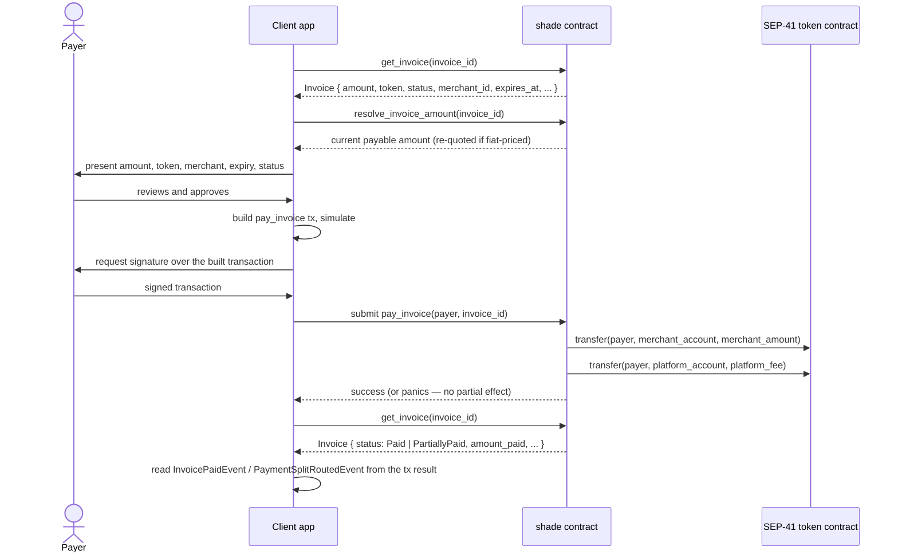

# Accepting payments

How to take a payer from an existing [invoice](../glossary.md#invoice) through to a confirmed on-chain payment against the `shade` contract: what to show them, what they sign, how to submit the transaction, and how to confirm and react to the result. Written for a client/backend developer integrating with `shade`, not for someone writing contract code.

## Prerequisites

- A `shade` contract already deployed and initialized, with the invoice's token added via `add_accepted_token` and accepted by the merchant (see [`is_token_accepted_for_merchant`](../reference/shade-interface.md#is_token_accepted_for_merchant)).
- An invoice already created by the merchant (`create_invoice`, `create_fiat_invoice`, or a finalized draft) — this guide starts from "an invoice ID exists," not invoice creation.
- A funded Stellar account for the payer, and familiarity with the Soroban RPC request lifecycle (simulate → sign → submit) — see [Building the Contracts](../getting-started/building.md) and [Prerequisites](../getting-started/prerequisites.md) if you haven't set up tooling yet.

## The end-to-end flow



1. **Invoice creation** happens upstream of this guide — the merchant already called `create_invoice`/`create_fiat_invoice`/`create_invoice_draft`+`finalize_invoice`.
2. **Present amount/token/merchant/state.** Call `get_invoice(invoice_id)` to fetch the `Invoice` record, and `resolve_invoice_amount(invoice_id)` to get the amount that would actually be charged right now (identical to `Invoice.amount` for a crypto-priced invoice; re-derived from the oracle for a fiat-priced one — see [Fiat-priced invoices](#fiat-priced-invoices) below).
3. **Payer review.** Show the payer the resolved amount, the token, the merchant, the invoice's `status`, and — if set — `expires_at`.
4. **Payer signs.** The payer authorizes the `pay_invoice` invocation for their own address; see [Authorization](#authorization) for exactly what this means under Soroban's auth model.
5. **Client submits `pay_invoice`.**
6. **Client observes confirmation** — either the submitted transaction succeeds (the token transfers happened, the invoice was updated) or the whole call panics and nothing changed; see [Error handling](#error-handling).
7. **Client confirms via `get_invoice`** — re-fetch the invoice and check `status`/`amount_paid`.
8. **Client consumes events** — `InvoicePaidEvent` and `PaymentSplitRoutedEvent` (and, inside the same call, `PlatformFeeRoutedEvent`) carry the payment details for indexing/notification; see [Events reference](../reference/events.md) for the full shape and [Precise semantics](../reference/events.md#precise-semantics) for what "confirmed" actually guarantees.

## The functions this flow uses

Signatures copied from [`contracts/shade/src/shade_interface.rs`](../../contracts/shade/src/shade_interface.rs):

```rust
fn get_invoice(env: Env, invoice_id: u64) -> Invoice;
fn resolve_invoice_amount(env: Env, invoice_id: u64) -> i128;
fn pay_invoice(env: Env, payer: Address, invoice_id: u64);
fn pay_invoice_partial(env: Env, payer: Address, invoice_id: u64, amount: i128);
fn pay_invoices_batch(env: Env, payer: Address, invoice_ids: Vec<u64>);
fn claim_refund(env: Env, buyer: Address, invoice_id: u64);
```

`pay_invoice` and `pay_invoice_partial` return nothing (`()`) — confirmation is "the call didn't panic," combined with a follow-up `get_invoice` read. Internally (see [`contracts/shade/src/components/invoice.rs`](../../contracts/shade/src/components/invoice.rs)), `pay_invoice` computes the full remaining amount and delegates to the same partial-payment path `pay_invoice_partial` uses, so a "full" payment and a "final partial" payment go through identical validation and settlement logic.

The `Invoice` type (fields you'll read back), from [`contracts/shade/src/types.rs`](../../contracts/shade/src/types.rs):

```rust
pub struct Invoice {
    pub id: u64,
    pub description: String,
    pub amount: i128,
    pub token: Address,
    pub status: InvoiceStatus,
    pub merchant_id: u64,
    pub payer: Option<Address>,
    pub date_created: u64,
    pub date_paid: Option<u64>,
    pub amount_paid: i128,
    pub amount_refunded: i128,
    pub expires_at: Option<u64>,
    pub pricing_mode: InvoicePricingMode,
    pub fiat_pricing: FiatPricingData,
}
```

`InvoiceStatus` (also from `types.rs`): `Pending = 0`, `Paid = 1`, `Cancelled = 2`, `Refunded = 3`, `PartiallyRefunded = 4`, `PartiallyPaid = 5`, `Draft = 6`.

## Authorization

**Do not oversimplify this to "the payer signs the transaction."** Two distinct authorizations are involved, and the client is responsible for constructing both correctly:

1. **The payer authorizes the `pay_invoice` invocation itself.** Inside the contract, `invoice::pay_invoice` calls `payer.require_auth()` as its first action (after the pause check `shade.rs` applies). This asserts that the transaction carries a valid Soroban authorization entry for the `payer` address, scoped to this specific invocation (contract address, function name, and arguments). If the payer address in the call doesn't match who actually signed, this fails before any other validation runs.
2. **The payer's token transfer is itself an authorized call.** Settlement happens via `platform_fee::route_from_payer` → `execute_split_transfers`, which calls the SEP-41 token contract's `transfer(source, destination, amount)` with `source = payer` — **not** `transfer_from` with a pre-approved allowance. Under Soroban's auth-tree model, when your top-level call (`pay_invoice`) requires `payer`'s authorization, and that call's execution in turn invokes the token contract's `transfer` on behalf of `payer`, the single top-level authorization the payer signed covers both — Soroban's host builds one authorization tree per invocation and the payer's signature over the outer call is what the inner `token.transfer` check consumes. **The payer does not need to have called `token.approve` first for `pay_invoice`** (contrast with `subscribe`, where [the interface doc comment explicitly says](../reference/shade-interface.md#subscribe) the customer must pre-approve an allowance, because `charge_subscription` runs later, without the customer present to sign that specific charge).
3. **What the client must actually construct and have signed:** a Soroban transaction invoking `pay_invoice(payer, invoice_id)`, whose authorization entries include the `payer` address's authorization for that invocation (most wallet/SDK flows derive this automatically from simulation — see the code sample below — but you must not skip simulation and hand-craft the auth entries incorrectly, since a mismatched auth tree fails at `require_auth` with no partial effect).

> **Security:** Never let a client construct `pay_invoice` with a `payer` argument that doesn't match the address that will actually sign. The contract has no way to know your UI's intent — it only sees the address passed as the argument and whether *that* address's authorization is present. See [Access control](../security/access-control.md) and [Signatures](../security/signatures.md) for the broader security model this sits inside.

## Fiat-priced invoices

An invoice created via `create_fiat_invoice` has `pricing_mode: InvoicePricingMode::FixedFiat` and a fiat target amount/currency/decimals in `fiat_pricing`. Its crypto `amount` field is **not fixed** — it is re-derived from the token's oracle price every time it matters, per [`contracts/shade/src/components/invoice.rs`](../../contracts/shade/src/components/invoice.rs)'s `resolve_fiat_invoice_amount`:

```rust
let numerator = fiat_pricing.amount
    * scale_factor(oracle_config.token_decimals)
    * scale_factor(oracle_config.price_decimals);
let denominator = price * scale_factor(fiat_pricing.decimals);
let resolved_amount = numerator / denominator;
```

**Exactly when re-resolution happens** (this is the actual, code-verified tolerance semantics — there is no separate "slippage tolerance" configuration; the contract's answer to drift is simply "re-quote until the first token lands"):

- `resolve_invoice_amount(invoice_id)` — a read-only query — re-resolves the amount **only if** `pricing_mode == FixedFiat` **and** `amount_paid == 0`. Once any payment has landed on the invoice, this function returns the stored `amount` unchanged, because the price at which the first payment settled is now the price the rest of the invoice is measured against.
- `pay_invoice_partial_inner` (invoked by both `pay_invoice` and `pay_invoice_partial`) calls `refresh_fiat_invoice_quote` at the top of every payment attempt, which applies the exact same rule: re-resolve and overwrite `Invoice.amount` (emitting `FiatInvoicePricedEvent`) only while `amount_paid == 0`. So **the very first payment against a fiat invoice always settles at a freshly re-resolved price**, not whatever `amount` was left over from invoice creation.
- After that first payment, `amount` is frozen for the life of the invoice — there is no re-resolution on subsequent partial payments, and no code path revalues an invoice that has already received a partial payment.

**Why/when to re-resolve on the client side:** call `resolve_invoice_amount` immediately before presenting the amount to the payer and immediately before submitting `pay_invoice`/`pay_invoice_partial`, because the price can move between those two moments — the contract's own re-quote at payment time is your actual protection against staleness, but your UI should show the payer a number that matches what they're about to authorize.

**What can change between quote and payment:** only the oracle price (`resolve_fiat_invoice_amount` re-reads it live via `PriceOracleClient::get_price`); the fiat target amount, currency, and decimals on the invoice never change after creation.

**Communicating drift to the payer:** because the contract re-derives the exact amount at payment time and that is what settles (there's no separate client-supplied "max amount" or slippage parameter on `pay_invoice`/`pay_invoice_partial` — compare with `PaymentPayload.max_slippage_bps`, which governs the *unrelated* swap-routing validation in `validate_payment_payload`, not fiat invoice pricing), the practical UX is: show the payer the amount from your most recent `resolve_invoice_amount` call, and re-fetch it right before submission if there was a meaningful delay. If the payer's wallet balance can't cover a higher re-resolved amount, the payment simply fails — see [Error handling](#error-handling).

**If the resolved amount no longer satisfies what the payer expected:** re-call `resolve_invoice_amount`, show the new figure, and let the payer decide whether to proceed, top up, or abandon. There is no on-chain price-lock or quote-expiry mechanism to fall back to.

## Partial payments

`pay_invoice_partial(payer, invoice_id, amount)` accepts any `amount` up to the invoice's remaining balance. From `pay_invoice_partial_inner`'s validation:

- `amount > 0`.
- Invoice must be `Pending` or `PartiallyPaid` (any other status panics `InvalidInvoiceStatus`, error 16).
- `amount_paid + amount` must not exceed `amount` (over-payment panics `InvalidAmount`, error 7 — there is no automatic refund of an excess amount; the call simply rejects it).

**Detecting a partial payment client-side:** after any payment, re-fetch the invoice and compare `amount_paid` to `amount`:

| Condition | Meaning |
|---|---|
| `amount_paid == 0` | Nothing paid yet (`status == Pending`) |
| `0 < amount_paid < amount` | Partially paid (`status == PartiallyPaid`) — remaining amount is `amount - amount_paid` |
| `amount_paid == amount` | Fully paid (`status == Paid`, `date_paid` is now `Some`) |

**What to show the payer:** the remaining balance (`amount - amount_paid`), not the original invoice total, once any partial payment has landed.

**Whether another payment is possible:** yes — as long as `status` is still `Pending` or `PartiallyPaid` and the remaining balance is positive, further calls to `pay_invoice_partial` (or a final `pay_invoice`, which pays exactly the remaining balance) succeed. Multiple payers *can* contribute to the same invoice's remaining balance across separate calls, but the first payer to pay anything is locked in as `Invoice.payer` — a second address attempting to pay panics `NotAuthorized` (see `pay_invoice_partial_inner`'s existing-payer check).

**Final settlement detection:** `status == Paid` and `date_paid.is_some()`. This is set in the same call that brings `amount_paid` to exactly `amount` — there is no separate "settlement" step to wait for.

`pay_invoices_batch(payer, invoice_ids)` pays a list of invoices to completion in one transaction, authorizing the payer once for the whole batch (see the code comment in `invoice.rs`: `require_auth` may only be called once per address per frame, so the per-invoice inner path does not re-authorize). If any invoice in the batch fails validation, the **entire batch transaction fails and nothing in it settles** — see [Error handling](#error-handling) and [Cross-Contract Calls: Failure Semantics](../architecture/cross-contract-calls.md#failure-semantics--atomic-guarantees).

## Error handling

Errors reachable from the payment path, from [`contracts/shade/src/errors.rs`](../../contracts/shade/src/errors.rs)'s `ContractError` enum (codes 1–99), mapped to what a client should tell the payer and do next:

| Error | Code | When it happens on this path | User-facing message | What the client should do |
|---|---|---|---|---|
| `NotAuthorized` | 1 | Payer's signature missing/invalid, or a second address tries to pay an invoice already claimed by another payer | "This payment could not be authorized." | Re-request the payer's signature; if a second-payer conflict, show that this invoice is already being paid by someone else |
| `InvalidAmount` | 7 | `pay_invoice_partial` amount ≤ 0, or would exceed the invoice total | "That amount isn't valid for this invoice." | Show the correct remaining balance and let the payer re-enter an amount within it |
| `ContractPaused` | 9 | The whole contract is paused | "Payments are temporarily unavailable." | Retry later; this is an operator-initiated pause, not something the payer can work around |
| `MerchantNotFound` | 6 | Extremely unlikely on this path (the invoice already references a merchant ID), but possible if merchant data is inconsistent | "This invoice can't be processed right now." | Surface to support; this indicates a data problem, not a user error |
| `InvalidInvoiceStatus` | 16 | Invoice is not `Pending`/`PartiallyPaid` (e.g. already `Paid`, `Cancelled`, or `Refunded`) | "This invoice has already been paid or is no longer payable." | Re-fetch the invoice and show its actual current status instead of a payment form |
| `InvoiceExpired` | 27 | Ledger time ≥ `expires_at` | "This invoice has expired." | Direct the payer back to the merchant for a new invoice; there is no "extend" call |
| `InsufficientBalance` | 30 | The merchant account doesn't hold enough balance for a **refund** path (`refund_invoice`/`refund_invoice_partial`/`claim_refund`) — not the payer's own balance, which the token contract's `transfer` enforces separately with its own error | "The merchant can't process this refund right now." | Relevant to refund flows only; a payer's own insufficient balance surfaces as a token-contract transfer failure, not this code |
| `TokenNotAccepted` | 12 | The invoice's token was removed from the global whitelist between creation and payment | "This invoice's payment token is no longer accepted." | Rare; direct the payer back to the merchant |
| `OracleNotConfigured` | 34 | Fiat-priced invoice whose token has no oracle configured | "This invoice's price can't be resolved right now." | Fiat invoices only; surface to support — this is a merchant/admin configuration gap |
| `OraclePriceUnavailable` | 35 | Oracle returns a non-positive price, or the fiat resolution computes to ≤ 0 | "This invoice's price can't be resolved right now." | Fiat invoices only; retry later or surface to support |

> **Note:** All of these are contract panics, not `Result::Err` values a client-side Rust caller would pattern-match against — from outside the contract (an RPC client, a wallet, a backend service), every one of them surfaces as a failed transaction whose result carries the numeric error code. Map the code to the table above in your client's error-handling layer.

## Working client code samples

The following follows the conventions this repository's own test suite uses for constructing and inspecting Soroban calls — see [Events reference: Decoding a real event](../reference/events.md#decoding-a-real-event) for the matching event-reading code. **Everything marked `<PLACEHOLDER>` is something you must supply**; nothing else here is pseudocode.

### Reading an invoice and its live resolved amount (read-only, no signature needed)

```rust
use soroban_sdk::{Address, Env};

// <PLACEHOLDER>: your RPC-connected Env/client setup is environment-specific;
// this shows the calls against a ShadeClient exactly as the test suite uses it.
let shade_client = ShadeClient::new(&env, &shade_contract_id); // shade_contract_id: <PLACEHOLDER>

let invoice_id: u64 = 42; // <PLACEHOLDER>: the invoice you're paying

let invoice = shade_client.get_invoice(&invoice_id);
let resolved_amount: i128 = shade_client.resolve_invoice_amount(&invoice_id);

// Present to the payer: resolved_amount, invoice.token, invoice.merchant_id,
// invoice.status, invoice.expires_at.
```

### Building, signing, and submitting `pay_invoice`

This mirrors how the test suite drives the same call (`shade_client.pay_invoice(&customer, &invoice_id)` in [`contracts/shade/src/tests/test_payment.rs`](../../contracts/shade/src/tests/test_payment.rs)), adapted to a real network flow where the client and the signer are different parties:

```rust
use soroban_sdk::{Address, Env};

let payer: Address = /* <PLACEHOLDER>: the payer's Stellar address */;
let invoice_id: u64 = 42; // <PLACEHOLDER>

// 1. Simulate the invocation to obtain the transaction and its required
//    authorization entries. In a real RPC-backed client this is a call to
//    Soroban RPC's simulateTransaction (or your SDK's equivalent wrapper);
//    it is not a soroban-sdk::Env call outside of tests, so no single
//    soroban-sdk API call is shown here — <PLACEHOLDER>: your SDK's
//    "build + simulate" step for invoking pay_invoice(payer, invoice_id)
//    against the deployed shade_contract_id on your target network.

// 2. Have the payer sign the resulting transaction (and, where required,
//    the auth entries the simulation surfaced for the `payer` address).
//    <PLACEHOLDER>: your wallet/signing integration.

// 3. Submit the signed transaction.
//    <PLACEHOLDER>: your SDK's "submit and await result" step
//    (Soroban RPC's sendTransaction, then poll getTransaction).

// 4. On success, confirm state directly from the contract:
let shade_client = ShadeClient::new(&env, &shade_contract_id);
let invoice = shade_client.get_invoice(&invoice_id);
assert_eq!(invoice.status, InvoiceStatus::Paid); // or PartiallyPaid
```

`<PLACEHOLDER>` items you must supply: the network RPC URL, the deployed `shade` contract ID, the payer's keypair/wallet integration, and whichever Stellar SDK you're using client-side (this repository's own tests use `soroban-sdk`'s in-process `Env`/`Client` pattern, which is only available inside Rust contract tests, not from an external application — an external client talks to the same functions through Soroban RPC and a language-appropriate Stellar SDK instead).

### Partial payment

```rust
let amount_to_pay: i128 = 500; // <PLACEHOLDER>: less than the remaining balance

// same simulate → sign → submit flow as above, invoking:
shade_client.pay_invoice_partial(&payer, &invoice_id, &amount_to_pay);

let invoice = shade_client.get_invoice(&invoice_id);
let remaining = invoice.amount - invoice.amount_paid;
```

### Reading the payment events after confirmation

```rust
use soroban_sdk::testutils::Events; // test-only; production clients read events
                                     // via RPC's getEvents / getTransaction result
use soroban_sdk::{Map, Symbol, TryIntoVal, Val};

let events = env.events().all();
for (contract_id, _topics, data) in events.iter() {
    if contract_id != shade_contract_id {
        continue;
    }
    if let Ok(fields) = data.try_into_val::<Map<Symbol, Val>>(&env) {
        if fields.contains_key(Symbol::new(&env, "merchant_id"))
            && fields.contains_key(Symbol::new(&env, "payer"))
        {
            // This is an InvoicePaidEvent — decode invoice_id, amount, fee,
            // token as shown in the Events reference's decoding example.
        }
    }
}
```

## Verify it worked

```bash
stellar contract invoke --id <shade-contract-id> --network <PLACEHOLDER> -- get_invoice --invoice_id 42
# Invoice { status: "Paid", amount_paid: <amount>, date_paid: Some(<timestamp>), ... }
```

Confirm `status` is `Paid` (or `PartiallyPaid` with the expected `amount_paid`) and that `payer` matches the address that submitted the transaction.

## Related pages

- [Events reference](../reference/events.md) — every event this flow can emit, and how to decode one.
- [The component pattern](../architecture/component-pattern.md) — how `pay_invoice` is wired from `shade_interface.rs` through to the `invoice` component.
- [Architecture overview](../architecture/overview.md) — the full `pay_invoice` request lifecycle and guard order.
- [Fiat pricing and oracles](../concepts/fiat-pricing-and-oracles.md)
- [Payment payloads, swap routing, and the cross-chain bridge placeholder](../concepts/payment-payloads-and-routing.md)
- [Access control](../security/access-control.md), [Signatures](../security/signatures.md)
- [`ShadeTrait` function reference](../reference/shade-interface.md)

← [Back to Guides](README.md)
